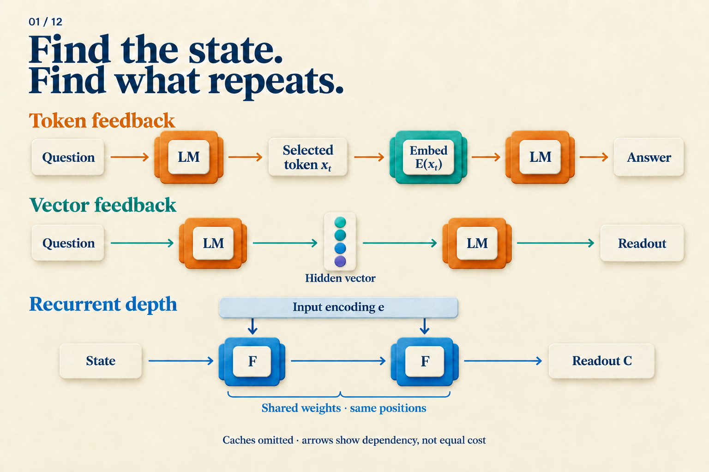

# What Happens Before a Model Gives Its Answer?

A warehouse has three boxes of parts, with twelve parts in each box. Four parts in total are unusable. How many remain?

One response says `3 × 12 = 36, then 36 − 4 = 32`. Another says only `32`. It is tempting to imagine the first model working through the problem and the second guessing. But what if the second model updated its internal state dozens of times before answering? The chat window would not tell us.

We will use this **teaching problem** to trace three possible computation paths. These are hypothetical execution traces, not measured outputs from three models. Our question is: **before the answer appears, what does the model use to keep computing?**

## Put “36” back into the model

Start with written reasoning. Once a model generates `3 × 12 = 36`, that text becomes part of the context. While generating the subtraction, it can read the earlier `36`.

The number on the page does not go directly into the next layer. Ordinary generation passes through an interface:

```text
Context → model pass → selected token
                           ↓
Next model pass ← that token's embedding
```

A token is a unit produced by the tokenizer; `36` may take one or more tokens. The output head converts the final hidden state into vocabulary scores. A decoding rule selects a token, and an embedding lookup turns it into the input at the next position. Each selected token extends the context.

Writing an intermediate step therefore has a computational role: **a result from one round can enter later computation through a text interface.** The original CoT work supplied worked examples in prompts, improving sufficiently large models on several reasoning tasks. This changed the prompt rather than training a new model for each task. [CoT v6, Sections 2–3](https://arxiv.org/abs/2201.11903v6)

Hiding that text from the interface changes what we see. If the system still generates it token by token, it still follows this path. Quiet-STaR's internal rationales, for example, consist of discrete tokens that help predict subsequent text. [Quiet-STaR v2, Section 4](https://arxiv.org/abs/2403.09629v2)

## What if the model did not have to select a word first?

Before choosing a token, the model already has a vector. Could that vector become the next input directly?

Coconut uses this feedback during its continuous phase. For our parts problem, a schematic trace looks like this:

```text
Process question → produce h[0]
Input h[0] → run model → produce h[1]
Input h[1] → run model → produce h[2]
End continuous phase → resume text output
```

Boundary tokens are omitted, and the step count is illustrative. The change occurs between model passes: a continuous vector replaces token selection followed by embedding lookup. This still adds sequence positions and still waits for the previous state. The model can also retain access to historical keys and values in its KV cache. [Coconut v2, Section 3](https://arxiv.org/abs/2412.06769v2)

Can we label `h[1]` as “36”? Not yet. We know how it is produced, but have not measured what it contains or established how the next step uses it. An arrow shows that information can travel; it does not reveal the learned algorithm. Article 04 develops the training of this path.

## Stay at the same positions and repeat an internal module

Both paths above advance along the sequence. Recurrent depth changes a different part of the computation: before reading out the next token, a shared internal module updates the state repeatedly.

Temporarily divide the model into three parts: `P` encodes the input, `F` updates the state, and `C` reads out the result. A hypothetical three-round execution is:

```text
e  = P(question)
s1 = F(e, s0)
s2 = F(e, s1)
s3 = F(e, s2)
next-token scores = C(s3)
```

First notice what stays unchanged: each round can access the input encoding `e`. Then follow `s0 → s1 → s2 → s3`: this is the state being updated. All three calls to `F` use the same weights but receive different states, so their outputs need not be identical. This follows the recurrent-depth paper's macroscopic prelude, shared core, and coda design; the paper also specifies details such as state initialization. We call the core `F` here, and use three rounds only for illustration. [Recurrent depth v1, Section 3.1 and Figure 2](https://arxiv.org/abs/2502.05171v1)

Each round need not add an intermediate token position. The state can span several existing positions. Nor does the architecture prescribe multiplication in the first round and subtraction in the second. Those are our written solution steps, not observations about the model.



*Follow the next-position input in the top two rows. Then locate the unchanged input encoding and the updated state in the bottom row. Historical caches are omitted; an LM box and an F box do not represent equal work.*

## Three paths leave different execution traces

If we could inspect system logs, the answer to the parts problem could remain `32` while the intermediate records differed:

| Path | What is added | What runs again |
|---|---|---|
| Token feedback | A selected token and position | Model pass at a new position |
| Continuous feedback | A computed vector and position | Model pass at a new position |
| Recurrent depth | A new state at existing positions | Shared core |

The table compares the three designs we just traced. It is not a set of mutually exclusive categories: a recurrent model can also generate a written chain, and a system can combine interfaces across stages.


*The overview now has a concrete meaning: all three outputs can be identical. The arrow counts do not rank latency, FLOPs, or accuracy.*

One more case belongs in the logs. A specially trained model may answer directly, with neither intermediate text nor an added feedback loop. Stepwise internalization progressively removes CoT prefixes from the training target until the model learns to predict the answer directly. It changes how the parameters learn the task; the training rule itself adds no extendable runtime loop. [Stepwise internalization v1, Section 3](https://arxiv.org/abs/2405.14838v1)

The absence of written steps can therefore come from a change in learning. We need to record both the help supplied during training and the operations executed at test time.

## Ask questions the execution log can answer

For the parts problem, we want to know where intermediate information is kept, which module runs again, and who determines the repetition count. These identify the state, operation, and budget.

Only then can we assess the result. Whether extra rounds improve accuracy requires testing on a fixed task. Whether they are faster requires measuring passes, cache handling, and final output. Sharing weights reduces the storage of distinct parameters; it does not turn three executions into one.

A readable explanation does not replace this investigation. The CoT paper presents written chains as a window into behavior while noting that they do not fully characterize the neural computation supporting an answer. [CoT v6, Sections 2 and 6](https://arxiv.org/abs/2201.11903v6)

The `32` in the chat window is where the investigation starts. Following its inputs, states, and repeated operations backward reveals what happened before it appeared.
