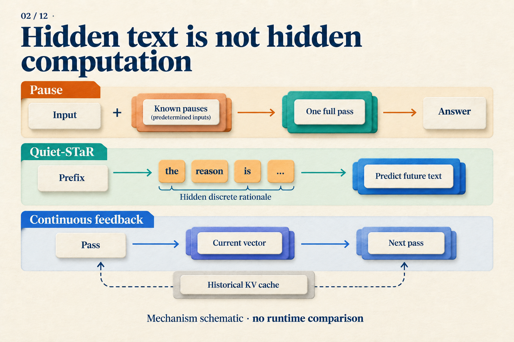

# Why Aren't Three Pause Tokens Three Reasoning Steps?

Given `A ⊆ B` and `B ⊆ C`, does `A ⊆ C` hold? Yes: every element of A belongs to B and therefore to C.

Before asking a language model to answer, we could append three predetermined pause tokens. Or we could let it generate three intermediate tokens. Both choices add three positions. **Do they add the same computation?**

We will trace this teaching problem through a two-layer Transformer. Two layers and three positions make the dependencies easy to inspect. We are not assuming that this model has learned the task, or assigning a logical rule to any pause position.

## The positions are known; their representations still have to be computed

Call the pause positions `p1, p2, p3`. They use the same special token, known before the model runs:

```text
Question | p1 | p2 | p3
```

The inputs are known, not their internal representations. Initially the model receives token embeddings and position information. Layer one transforms these inputs; layer two then processes the layer-one representations.

For our illustrative model with causal attention, follow the last pause position:

| Stage | What p3 can read |
|---|---|
| Input setup | Known pause embedding and position information |
| Layer-one attention | Layer inputs at the question and p1, p2, p3 |
| Layer-two attention | Layer-one representations at those positions |
| Readout | Predict the first answer token from p3's final state |

When layer one computes `p3`, it does not need `p2`'s layer-one output: it reads **the inputs to that layer**. Because the entire input sequence is known, positions can be processed in a batch within each layer. The causal mask restricts access; it does not require executing positions one at a time from left to right.

In layer two, `p3` can read representations that layer one computed at `p1` and `p2`. Extra positions thus supply intermediate representations and computation paths. They remain inside the two-layer network, however. They have not created three rounds that each run the whole network.

The Pause-training paper motivates extra positions this way and discusses computational width versus serial depth. Our table illustrates a causal mask; the mask used for an actual task must be checked in the paper. [Pause-training v1, Sections 2–3 and 6](https://arxiv.org/abs/2310.02226v1)


*“One pass” does not mean free: extra positions require extra operations. It means those inputs can be supplied together. On the right, later inputs do not yet exist. The left panel shows positions schematically; our three pauses all follow the question.*

## Generated tokens introduce a different wait

Replace those predetermined pauses with generated intermediate tokens `u1, u2, u3`. Before its first pass, the model does not know what `u1` will be, let alone the other two.

To reach the first answer token, the dependency becomes:

```text
Process question       → choose u1
Process the new u1     → choose u2
Process the new u2     → choose u3
Process the new u3     → choose first answer token
```

The new position on each line traverses the model's layers. A KV cache avoids recomputing historical positions, but cannot supply an input that has not yet been selected. We are comparing the path to the first answer token; a multi-token answer requires further generation in either case.

For our subset problem, a written chain could state that an arbitrary element of A belongs to B and then to C. This places readable intermediate conclusions in the later context. Pause positions have no such annotated contents; the model must learn how to use them.

Three pauses and three generated tokens therefore have equal counts but different serial dependencies. That difference does not establish a threefold speedup: the work per pass, caching, and hardware scheduling still affect latency.

## What teaches a model to use a pause?

During training, we can require the model to predict the correct answer after the pauses. Prediction error backpropagates through the computation, updating pause embeddings and model parameters. If pause positions influence the answer, they participate in this learning path. We do not need to label `p1` as “A belongs to B” for a training signal to exist.

Pause-training uses a dedicated learned token. During pretraining it inserts this token at random locations and excludes predictions of the pause token from the loss. Downstream finetuning appends a fixed number of pauses before supervising the target text. These trained interventions differ from casually adding punctuation to a chat prompt. [Pause-training v1, Section 3.1](https://arxiv.org/abs/2310.02226v1)

A useful comparison is whether models encounter pauses only during finetuning or during both pretraining and finetuning. The paper tests these combinations with 130M and 1B models. Pausing in both stages improves most tested tasks; introducing it only at finetuning gives mixed results. This supports learning to use the extra positions, without revealing an algorithm at each position. [Pause-training v1, Section 4.3](https://arxiv.org/abs/2310.02226v1)

Nor should we assume that thirty pauses beat three. The paper's pause-count ablations do not show indefinitely growing gains. Changing the count at test time also changes the input distribution learned during training. [Pause-training v1, Section 5](https://arxiv.org/abs/2310.02226v1)

## A chain already present in training data is a different case

The sequential wait above concerns **generation at runtime**. If training data already supplies the correct chain `u1, u2, u3`, we can prepare it all at once:

| Target | Prefix supplied by teacher forcing |
|---|---|
| u1 | Question |
| u2 | Question + correct u1 |
| u3 | Question + correct u1, u2 |
| Answer | Question + correct u1, u2, u3 |

A causal mask lets one training pass learn these targets while exposing each target only to its prefix. Training uses the correct history rather than first sampling it. The same text can therefore be trained in a batch yet require sequential generation.

Continuous feedback differs again. Its next input comes from an earlier computation, with no known token column to fill in beforehand. Coconut must produce continuous states step by step during training before computing the remaining text loss. [Coconut v2, Section 3, Training Details](https://arxiv.org/abs/2412.06769v2)

## Which side do hidden rationales belong on?

Look at how their inputs are produced. Quiet-STaR generates discrete auxiliary rationales after text prefixes, mixes subsequent predictions with and without those rationales, and learns from their benefit to future-text prediction. Candidates for different prefixes can be organized in parallel. Within a candidate, tokens still advance sequentially, and separate branches cannot freely read each other. [Quiet-STaR v2, Sections 4.1–4.4](https://arxiv.org/abs/2403.09629v2)

Whether a rationale is displayed is separate from whether its inputs require a wait. A reward for predicting future text is also not a direct score for logical correctness.



*Read these rows by asking whether an input is predetermined or produced by an earlier step. The feedback vector and historical cache are separate because the next step can access more than one vector.*

The original CoT paper also tested equation-only prompts, nonsemantic outputs, and explanations placed after answers to investigate the role of intermediate text. Those prompting ablations motivate separating the factors; they do not replace each method's training experiments. [CoT v6, Section 3.3](https://arxiv.org/abs/2201.11903v6)

Whether three pauses help is ultimately a question for task performance. Before answering it, make “three more thinking steps” precise: three known positions, or three advances whose inputs depend on earlier outputs? That distinction changes both training and cost accounting.
