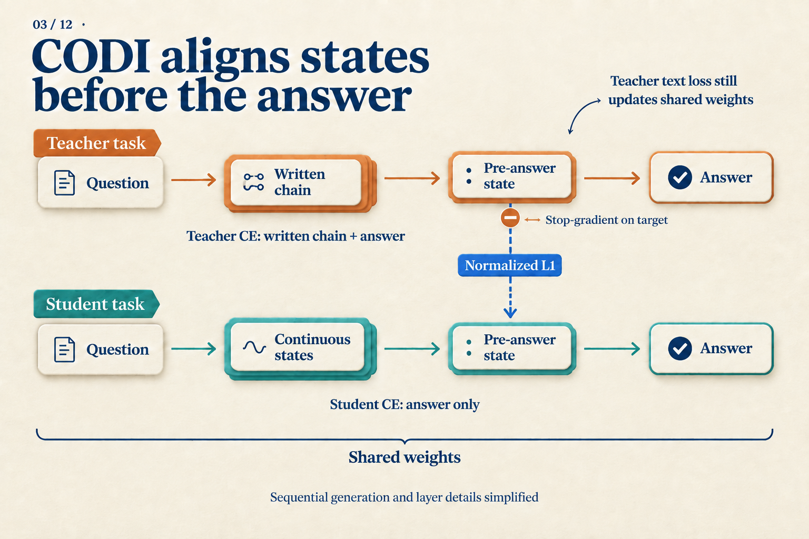
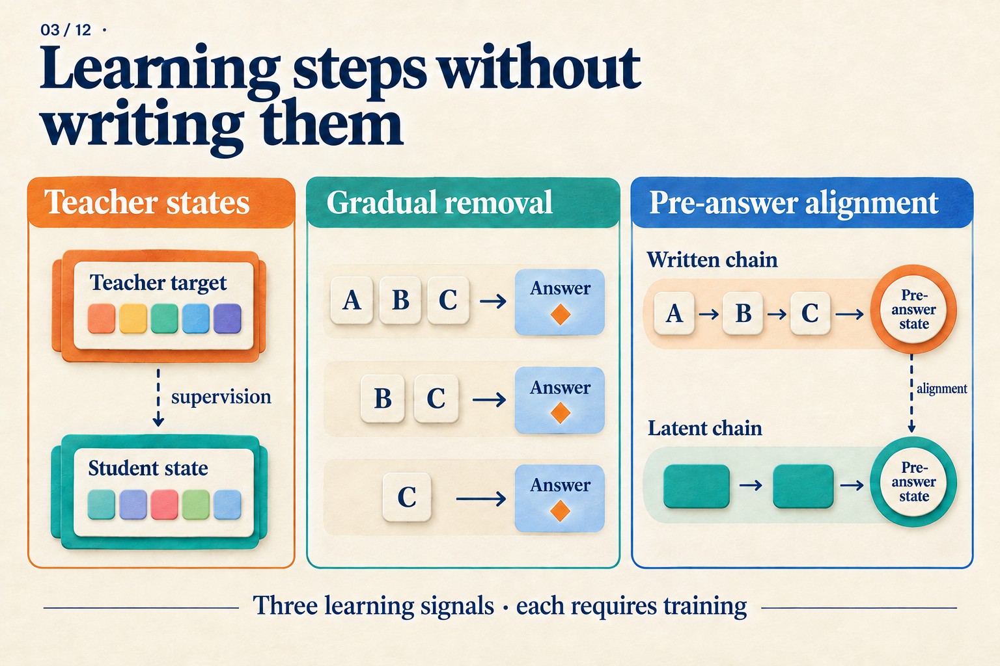

# Where Does the Training Error Come From After We Remove the Steps?

Four bags contain six marbles each. After removing eight marbles, we divide the rest equally between two people. How many does each person receive?

For this **teaching problem**, a training example could contain:

```text
A: 4 × 6 = 24
B: 24 − 8 = 16
C: 16 ÷ 2 = 8
Answer: 8
```

A, B, and C name written steps. They are not individual tokens or known hidden states. Suppose we want to train a model that eventually answers only `8`. Deleting A, B, and C is easy; keeping the model useful after their removal is the challenge.

The question is: **which prediction targets disappear with the text, and which error signals can still reach the model?**

## What can one answer loss tell the model?

For a hand calculation, assume the answer `8` is one token. If the model assigns it probability 0.25, its cross-entropy loss is `−ln(0.25) ≈ 1.386`. Raising that probability to 0.5 reduces the loss to `−ln(0.5) ≈ 0.693`.

These are illustrative probabilities, not measured model predictions. They show what answer supervision rewards: a higher probability for the correct token. Through the chain rule, the loss can update earlier parameters, so answer-only supervision can teach a model.

It does not separately require the model to obtain `24` and then `16`. A complete written chain provides additional prediction targets: predict A from the question, B after reading the correct A, and so on. Teacher forcing supplies these correct prefixes during training; generation instead uses the model's own outputs.

Removing steps therefore changes two things: the text available to later predictions and the text the model must predict. Different training methods address this change at different points.

## Remove less at first, so the next target can carry the training

Rather than delete everything at once, train on the complete chain and gradually remove its beginning until only the answer remains.

| Curriculum point | Remaining targets | First prediction |
|---|---|---|
| Full chain | A → B → C → answer | A from the question |
| A removed | B → C → answer | B from the question |
| A and B removed | C → answer | C from the question |
| All steps removed | Answer | 8 directly from the question |

*These are coarse milestones at whole-step boundaries. The stepwise-internalization paper removes prefix tokens, passing through additional stages not drawn here. The question always remains; removed steps do not leave blank placeholders in the input.*

Look at the second row. The model must still predict `24 − 8 = 16`, but no longer reads `4 × 6 = 24` first. This remaining target makes the new learning problem concrete: compensate for the missing text using the question itself. After adapting, it can lose more of the prefix.

Stepwise internalization uses this curriculum, with optimizer-state resets and randomized offsets in the removal count to handle unstable transitions. It does not require a hidden vector to reconstruct A word for word. The final target is direct answering; deletion alone adds no test-time loop. [Stepwise internalization v1, Section 3](https://arxiv.org/abs/2405.14838v1)

Success still needs measurement. The paper reports strong multiplication results, but explicit CoT remains stronger on GSM8K. Checkpoints along a harder multiplication curriculum also trade accuracy for speed. The last table row is a training target, not a guarantee of success. [Stepwise internalization v1, Sections 5–6 and Tables 2–3](https://arxiv.org/abs/2405.14838v1)

## How can the loss pass through an internal computation position?

Consider a different execution path: A is gone, but the model produces continuous states `h1, h2` before answering. There are no correct words to fill into those positions.

```text
Question → h1 → h2 → predict remaining text and answer
                         ↑
                 Compute prediction loss here
```

If `h2` affects the answer probability, the answer loss can update the parameters that produced `h2`. If `h2` depends on `h1`, gradients can continue through `h1`. **A position without its own token target can still receive gradients.**

Coconut combines continuous feedback with a curriculum. It computes loss on remaining text and answers, masking token losses on the question and continuous positions. Article 04 follows the execution in detail. Here the important point is loss placement: continuous states learn by helping later predictions, without having to reconstruct each removed sentence. [Coconut v2, Section 3 and Figure 2](https://arxiv.org/abs/2412.06769v2)

This supplies a learning path, but leaves a choice. Is final prediction supervision enough to make useful internal states easy to learn? If a teacher has already worked through a complete solution, could it supply another target?

## A teacher can supply states—but who produces them at test time?

Early implicit-CoT distillation separates three stages: teach a student to answer using teacher states, train an emulator to predict those states from the question, and jointly optimize the connected emulator and student. The targets are representations at selected layers and token positions, not every activation in the trajectory. [Implicit CoT distillation v1, Sections 3.1–3.3](https://arxiv.org/abs/2311.01460v1)

For the marbles problem, training can first run a teacher with A, B, and C, extract selected states, and teach the student to use them. At test time only the question is available. We cannot quietly supply the correct A, B, and C again. The state predictor is therefore essential, and its cost belongs in inference accounting.

This division also exposes a difficulty: one problem can have several correct written solutions. We could first allocate `24 ÷ 2 = 12` marbles to each person, then subtract each person's share of the removed marbles, `8 ÷ 2 = 4`, again obtaining `8`. Different teacher paths may produce different state targets. The paper introduces mixture representations with intermediate-token supervision to address multiple pathways rather than averaging their modes together. [Implicit CoT distillation v1, Section 3.2](https://arxiv.org/abs/2311.01460v1)

A state target is thus not a ready-made universal answer key. We must choose what to align, handle alternative targets, and produce replacement states at test time.

## Put additional supervision just before the answer

CODI chooses a more focused alignment location: the colon in `The answer is:`. Its two training tasks share model weights. The teacher reads written reasoning, the student performs continuous computation, and their activations at this position are aligned across layers. [CODI v2, Sections 3.1–3.4](https://arxiv.org/abs/2502.21074v2)

Why inspect this position? In the marbles example, it sits between access to earlier computation and prediction of the answer. Alignment supplies an internal target related to answering without assigning `24`, `16`, and `8` to individual continuous positions.

Separate the three losses first:

| Loss | What it compares |
|---|---|
| Teacher text loss | Predictions of reasoning and answer against correct tokens |
| Student answer loss | Answer predictions after continuous computation against correct tokens |
| State distillation loss | Student activations before the answer against teacher activations |

The total objective combines them with weights:

`L = α Lteacher + β Lstudent + γ LKD`

The first two are the token prediction losses we already discussed. The third uses L1 distance: coordinate-wise absolute differences, with normalization based on teacher activation scales. As a **pure illustration**, normalized teacher coordinates `[2, −1]` and student coordinates `[1, −0.5]` have absolute differences `[1, 0.5]`. The actual loss aggregates activations at the selected position across layers. These two coordinates do not represent marble counts. [CODI v2, Sections 3.4–3.5](https://arxiv.org/abs/2502.21074v2)



*Follow the horizontal paths to the text losses, then the dashed edge to the state loss. Stop-gradient applies only to the teacher target on that edge. The teacher's text loss still updates shared weights.*

If the state loss also pulled the teacher toward the student, both sides could move toward each other. CODI stops teacher gradients on this edge so the student moves toward the current teacher target. The teacher task still has its own learning signal. Drawing the entire teacher as permanently frozen would misrepresent the shared-weight design.

There is also a data detail. Step C in our example already states `8`. If the teacher reads it, the pre-answer state may only need to retain the answer. CODI removes the final answer-giving step from training trajectories and reports worse ablation performance when keeping it. This reduces a shortcut; it does not establish that all remaining states encode complete algorithms. [CODI v2, Sections 3.5 and 4.4, Table 2](https://arxiv.org/abs/2502.21074v2)

## Return to the shortened training example

The same `A → B → C → answer` now suggests three kinds of help: gradually reduce the written support, supply teacher-state targets, or align representations just before answering.



*The middle panel's A, B, and C can represent our written steps. This is a map of supervision methods, not a claim that each removed step is stored in one vector.*

These methods can improve direct or continuous answering. Their loss functions do not imply universal equivalence to explicit CoT. CODI's out-of-distribution math evaluation gives a concrete reminder: its GPT-2 setting beats the table's explicit baseline, while its LLaMA-1B setting trails explicit CoT on the same three benchmarks. [CODI v2, Section 4.3 and Table 1](https://arxiv.org/abs/2502.21074v2)

When reading the next implicit-reasoning method, take one training example and mark the retained targets, the locations of its losses, and what must produce states at test time. That describes the learning problem more precisely than asking only whether it uses CoT supervision.
