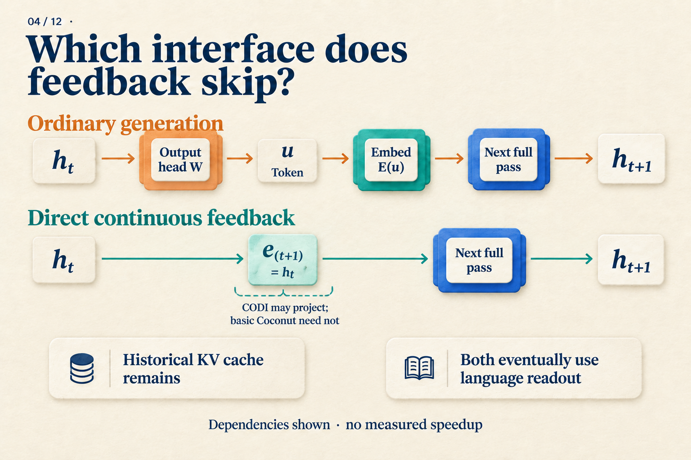

# How Does a Model Keep Computing Without Writing the Steps?

There are three boxes of parts, with twelve parts in each box. Four parts are damaged. How many usable parts remain?

We could write `3 × 12 = 36`, followed by `36 − 4 = 32`. For an autoregressive language model, those written steps serve another purpose: they enter the context, where later computation can read them.

That suggests a question: **once a model has produced an internal representation, why must it turn that representation into tokens before continuing?**

Coconut changes this interface. During part of its computation, it passes the current hidden state directly to the next position. We will follow the parts problem to understand how that path runs, how it is trained, and what the experiments show. The parts problem is a teaching example; the performance figures come from the paper.

## How does a written result get back into the model?

Start with ordinary generation. The model processes the available context and produces a final hidden state `h[t]`. An output head maps it to scores over the vocabulary, and a decoding rule chooses a token `u`. The next step looks up its embedding `E(u)` and feeds that vector back into the model.

```text
Current hidden state → output head → token choice → embedding lookup → next forward pass
```

The “36” in our example enters the context through this process; the tokenizer determines how many tokens it takes. When generating the subtraction, the model can use attention to read the preceding text and its representations.

Keep two things separate: **the input at the new position**, and **the history it can read**. The new input comes from the selected token. The history includes the question and the steps already written. This distinction will matter when we change the interface.

## Feed the hidden state into the next position

During Coconut's continuous phase, the model skips token selection and embedding lookup. It uses:

`e[t+1] = h[t]`

The left side is the next position's input; the right side is the current position's final-layer hidden state. The equals sign is the key: **the output vector from this computation becomes the input vector for the next one.** [Coconut v2, Section 3](https://arxiv.org/abs/2412.06769v2)



*Follow the interface between h[t] and the next forward pass in the top row, then see what replaces it below. The optional CODI projection is a different design; basic Coconut uses direct feedback. Language readout denotes output after the continuous phase. The diagram omits phase-boundary tokens.* [CODI v2, Section 3.3](https://arxiv.org/abs/2502.21074v2)

Walk through two steps. Coconut marks the beginning and end of a continuous interval with `<bot>` and `<eot>`:

1. Process the question and `<bot>`. Call the final-layer hidden state at `<bot>` `h[0]`.
2. Use `h[0]` as the input at the first continuous position. Run a forward pass to obtain `h[1]`.
3. Use `h[1]` as the input at the second continuous position. Run another forward pass to obtain `h[2]`.
4. End the continuous phase, insert `<eot>`, and resume ordinary token inputs and language output.

Each step can still attend to the available history. A KV cache stores keys and values for positions already processed, avoiding their recomputation; the new position still needs a forward pass. A fuller picture of Coconut's running state is therefore “the current input vector, plus accessible history.” [Coconut v2, Section 3](https://arxiv.org/abs/2412.06769v2)

For the parts problem, we now know how `h[0]`, `h[1]`, and `h[2]` are produced. We do not yet know whether any of them explicitly represents “36.” The interface specifies how data flows. Making that path useful requires learning what information to put through it.

## How does the model learn to continue without written support?

Coconut starts with training examples that include written reasoning. It gradually removes the initial reasoning steps and replaces them with continuous positions. In this illustration, each removed step adds one continuous position: `c = 1`.

| Stage | Positions | Written steps | Answer |
|---|---:|---|---|
| 0 | 0 | `3 × 12 = 36`; `36 − 4 = 32` | `32` |
| 1 | 1 | `36 − 4 = 32` | `32` |
| 2 | 2 | None | `32` |

*The question remains at every stage. Boundary tokens are omitted. The model produces the vectors at continuous positions; those slots are not prefilled with “36” or “32.” This table illustrates the curriculum rule.*

At stage 1, the model must predict the remaining subtraction without receiving the first written step. Prediction error from the remaining text and answer backpropagates through the continuous feedback, encouraging the model to use the new interface. At stage 2, the written reasoning is gone, but the answer still supplies supervision.

This explains an easy misunderstanding. The training schedule lets a continuous position take the place of a written step, but **the loss does not require that vector to reconstruct the removed sentence word for word**. Its representation is shaped by the downstream task and optimization.

In the paper, stage `k` replaces the first `k` reasoning steps with `k × c` continuous positions. The GSM8K setting uses `c = 2`: the count rises from 0 to 2, 4, and 6, then stays at 6 in later stages while the remaining written steps are removed. Our two-step example illustrates the rule, not the complete experimental recipe. [Coconut v2, Sections 3 and 4.2](https://arxiv.org/abs/2412.06769v2)

The execution path and training signal now fit together. Continuous feedback provides a place to keep computing; the curriculum teaches the model to use it as written support disappears. The next question is how many problems the resulting model gets right.

## What did it learn? Start with math, then look at logic

The paper compares several training methods using GPT-2. Here are three rows from Table 1. Values are accuracy percentages, with the reported `±` terms retained.

| Method | GSM8K math | ProntoQA logic | ProsQA logic |
|---|---:|---:|---:|
| Direct answer (No-CoT) | 16.5 ± 0.5 | 93.8 ± 0.7 | 76.7 ± 1.0 |
| Explicit chain of thought (CoT) | 42.9 ± 0.2 | 98.8 ± 0.8 | 77.5 ± 1.9 |
| Coconut | 34.1 ± 1.5 | 99.8 ± 0.2 | 97.0 ± 0.3 |

*Source: Coconut v2, Table 1. Experiments use greedy decoding and select checkpoints on validation data. These figures apply to the paper's models, datasets, and training settings.* [Sections 4 and Table 1](https://arxiv.org/abs/2412.06769v2)

Start with GSM8K. Coconut's 34.1 exceeds the direct-answer model's 16.5, but falls short of explicit CoT's 42.9. For the mathematical motivation behind our parts example, this is a concrete tradeoff: continuous computation learns something useful, while retaining less accuracy than a written chain in this setting.

On ProsQA, Coconut substantially outperforms explicit CoT. Those three rows, however, cannot assign all the gain to continuous feedback. The original table also includes iCoT, which gradually removes written reasoning and ultimately answers directly. It reaches **98.2 ± 0.3** on ProsQA, above Coconut. The curriculum itself is a factor to examine separately. [Coconut v2, Table 1 and Section 4.3](https://arxiv.org/abs/2412.06769v2)

Writing fewer steps and running faster also require separate measurements. In our two-step walkthrough, the second continuous input cannot be produced until `h[1]` exists. That dependency remains. The main experiments generally use a preset number of continuous steps, and adding positions does not improve performance indefinitely. Deciding whether an implementation is worthwhile requires comparing answer quality with measured latency. [Coconut v2, Sections 3 and 4.4, Appendix C](https://arxiv.org/abs/2412.06769v2)

## Could avoiding a token choice preserve several possible paths?

Continuous representations suggest a possibility: perhaps a model can retain several candidates, compute further, and commit later. The paper investigates this idea on synthetic logic tasks.

The researchers train a variant with a mixture of curriculum stages, allowing it to switch back to language after different numbers of continuous steps. They then compare readout probabilities for candidate concepts. Several candidates receive appreciable probability, followed by concentration on more promising paths. These observations support a search-like interpretation. [Coconut v2, Section 5](https://arxiv.org/abs/2412.06769v2)

The readouts reveal candidate probabilities, not a fully decoded internal search tree or proof of standard breadth-first search. This analysis also uses a specially trained variant. It can motivate a mechanism hypothesis, but it does not assign a known reasoning step to each vector in our parts example.

## Where does this fit among continuous-reasoning methods?

We can now describe Coconut's core path: **previous final-layer hidden state → next-position input → another model forward pass**. “Continuous” describes the representation passed between steps; continued computation comes from the forward passes still being executed.

Other methods give continuous vectors different jobs. This diagram is easier to read after working through Coconut:


*The first row is the feedback mechanism developed in this article. The other rows locate related approaches; they do not imply equal computation costs.*

CCoT studies how to predict a small set of compressed teacher-trajectory states from the question and supply them to an answer decoder. SoftCoT++ uses diverse soft prompts to guide subsequent explicit reasoning. One focuses on predicting compressed states; the other adds starting points for reasoning. They are useful directions for further reading, without being prerequisites for understanding Coconut. [CCoT v1, Sections 3–4](https://arxiv.org/abs/2412.13171v1); [SoftCoT++ v1, Section 3](https://arxiv.org/abs/2505.11484v1)

Return to the parts problem. Hiding the written work describes the output. Coconut makes a specific computational change: it passes intermediate computation to the next step through continuous vectors, then trains that path to support the task. What the states preserve, and when this works better than writing the steps, remain questions for mechanism analysis and experiments, respectively.
