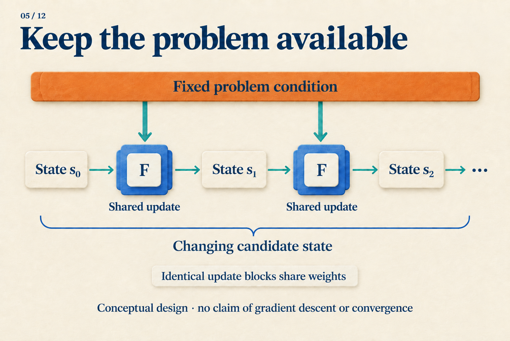
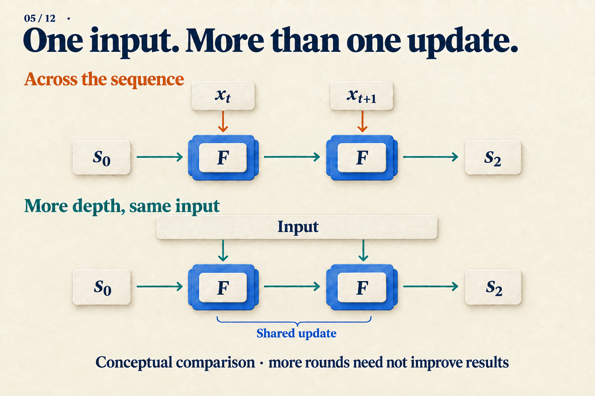

# Why Run the Same Transformer Again?

Add `0111 + 0001`, or `7 + 1`. The rightmost `1 + 1` creates a carry. That carry meets another `1`, then another, before reaching the leftmost `0`. The answer is `1000`.

This small problem helps explain why repeated computation can be useful. **The following parallel carry algorithm is constructed for teaching; it is not an observation of a Transformer's hidden states.** Starting with a known rule lets us ask what a neural network would need to learn.

## Let a carry travel one position per round

Treat the four bits as four positions, numbering the rightmost one 0. Each position retains its two input bits and an incoming carry. The rule is simple: two input ones generate a carry; exactly one input one passes an incoming carry onward; two zeros produce no carry.

Update all positions simultaneously, using carries from the **previous round**. A newly produced carry must therefore wait until the next round to travel farther. Initialize the carries to zero:

| Completed update rounds | Carries entering positions 3, 2, 1 | Four-bit readout using current carries |
|---|---|---|
| 0 | `000` | `0110` |
| 1 | `001` | `0100` |
| 2 | `011` | `0000` |
| 3 | `111` | `1000` |
| 4 | `111` | `1000` |

*Carries and outputs are written from most to least significant bit. Position 0 always receives zero carry; this example has no overflow beyond four bits. Early rows are unfinished readouts, not alternative arithmetic answers.*

In round 1, the rightmost position detects `1 + 1` and sends a carry into position 1. In round 2, position 1 passes it to position 2. In round 3, it finally reaches position 3. Round 4 has no further information to propagate, so the answer remains unchanged.

For each position `i`, the simultaneous update can be written as:

```text
next_carry[i+1] = (a[i] AND b[i])
                 OR ((a[i] XOR b[i]) AND carry[i])
result_bit[i]   = a[i] XOR b[i] XOR carry[i]
```

**The rule stays the same; the state it receives changes.** Once a later round supplies a new carry, the same small rule makes further progress. It does not need a separate algorithm for rounds one, two, and three.

This is a local update rule. Self-attention can connect more distant positions, so the table is not a lower bound requiring a Transformer to use three rounds.

## Put that process inside a neural network

A shared module can repeatedly update a state:

`next_state = F(problem_condition, current_state)`

For our carry algorithm, the fixed condition consists of the two original numbers, and the changing state contains incoming carries. A neural network would use vectors or matrices, learning an update that remains useful at different intermediate states.



*Read the upper path as the two available input numbers, and the horizontal path as propagating carries. This analogy explains the roles of input and state; it does not identify a learned algorithm.*

Repeatedly supplying the problem has a practical motivation. The working state can change without also having to preserve an undamaged copy of the original question forever.

In a study of fitting functions from in-context examples, *Looped Transformers are Better at Learning Learning Algorithms* initializes the state to zero, injects the input each round, and supervises later iterations. Its linear-regression ablation finds greater degradation beyond trained iterations when weights are tied without repeated input injection. This supports the design in that setting without identifying a particular internal optimization algorithm. [Paper v3, Sections 4–4.1 and Figure 3](https://arxiv.org/abs/2311.12424v3)

## Which direction does “another step” move?

An ordinary sequence RNN also shares parameters, usually updating as the next input arrives. Our carry computation instead spends another round on a problem that is already available.



*One path changes input position; the other adds internal rounds. Their steps need not cost the same.*

We can write a state with two indices, `s[t,r]`. The first asks which input position is being processed; the second asks how many internal updates have occurred. Recurrent depth concerns the second coordinate.

Universal Transformer repeatedly applies shared self-attention and transition modules to the same sequence positions. Separate position and iteration encodings identify where an update occurs and which round it belongs to. Positions can update in parallel within a round; successive rounds remain dependent. [Universal Transformers v3, Section 2.1](https://arxiv.org/abs/1807.03819v3)

ACT learns how long to continue processing an input using accumulated halting values and remainder-weighted state and output mixtures. The dynamic Universal Transformer applies this idea per position. Article 08 works through stopping numerically. Here, the useful distinction is that **sharing an update and choosing its execution count are separate design decisions.** [ACT v6, Section 2](https://arxiv.org/abs/1603.08983v6); [Universal Transformers v3, Section 2.2](https://arxiv.org/abs/1807.03819v3)

## Why is drawing a loop insufficient?

Our carry algorithm keeps a consistent state meaning: the carry reaching each position. A trained network could instead learn to prepare an answer specifically at round three, then alter it again at round four. Shared weights do not prevent the state from carrying an internal counter.

That may be acceptable if the goal is fewer distinct parameters. Subformer shares middle layers, retains independent first and last layers, and uses embedding factorization to study parameter efficiency. Success at that goal does not establish useful arbitrary extra iterations. [Subformer v3, Sections 2–3](https://arxiv.org/abs/2101.00234v3)

Preserving a completed answer requires more from an update. Deep Equilibrium Models take a different approach: they define the output through a fixed-point equation, solve for it in the forward pass, and use implicit differentiation. Their target is an equilibrium; finite recurrent models can also use helpful states reached before equilibrium. [Deep Equilibrium Models v2, Section 3.1](https://arxiv.org/abs/1909.01377v2)

This makes a useful experiment concrete. Keep bit length fixed while increasing carry-chain length. Check whether additional rounds correct unfinished outputs and preserve completed ones. That experiment remains to be run on a learned update. The hand-designed rule supplies a clear reference: worthwhile repetition should take the progress already made and continue solving the same problem.
