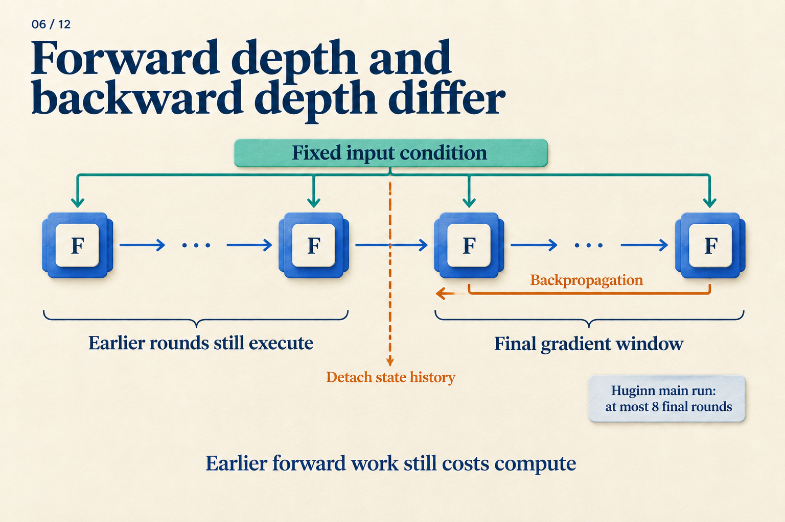

# Four Forward Rounds, but Only Two Backward?

“Run four rounds” does not specify how a loss trains those rounds. A small calculation can separate forward execution from backpropagation before we move to language models.

**This scalar model is constructed for teaching, not measured from Huginn or Ouro.** Fix the input at `e = 1`, initialize `s[0] = 0`, and reuse `w = 0.5` every round:

` s[r] = w × s[r−1] + e `

The input is added again each round. The state changes; the parameter and input stay fixed.

## Actually run all four rounds

| Round | Calculation | Resulting state |
|---|---|---:|
| 1 | `0.5 × 0 + 1` | 1 |
| 2 | `0.5 × 1 + 1` | 1.5 |
| 3 | `0.5 × 1.5 + 1` | 1.75 |
| 4 | `0.5 × 1.75 + 1` | 1.875 |

Suppose the target is 2, with a loss only after round four: `L = (s[4] − 2)² / 2 = 0.0078125`.

The first three rounds have no separate losses, but they help produce the final state. Full backpropagation traces the entire dependency chain, adding the contributions from each use of `w` to **the same parameter**.

Now change one thing. After round two, keep the value 1.5 but stop tracking how it was produced. Automatic differentiation commonly calls this operation `detach`.

```text
s = 0
s = w * s + e       # round 1
s = w * s + e       # round 2
s = detach(s)       # keep 1.5; stop its gradient history
s = w * s + e       # round 3
s = w * s + e       # round 4
loss = (s - 2)**2 / 2
```

**The forward result is identical; the gradient is different.** In the full chain, `s[4] = 1 + w + w² + w³`, giving `dL/dw = −0.34375` at `w = 0.5`. After detaching, backpropagation treats the value 1.5 as constant and gives `dL/dw = −0.3125`.

That difference is information discarded by truncation. The early rounds still execute and affect the answer; this gradient simply does not pass through their operations. Because `w` is shared, its late-round gradient still updates it. The early rounds will use that updated parameter in the next forward pass.



*For our calculation, put the boundary after round two. The ellipses represent a generic unroll. The note about at most eight final rounds describes Huginn's main run, not this two-round window.*

## What changes in a language model?

Replace scalar `s` with a state matrix, replace `w × s + e` with a shared Transformer core, and attach a readout:

```text
e = prelude(tokens)
s = initial_state()
repeat K times:
    s = core(e, s)
logits = coda(s)
loss = next_token_loss(logits, target_tokens)
```

Next-token labels can supervise the loop without a separate “correct thought” for every round. Loss placement determines which states must be readable. The backward window determines how much of their formation this update can trace. These are separate controls.

For example, all four rounds might execute with a loss only at round four. Alternatively, read out at rounds two and four and combine their losses. The first arrangement allows round two to be temporarily hard to decode; the second makes it responsible for the target too. **Adding a readout loss does not add a core iteration.**

Huginn supplies a fixed prelude condition, initializes a random recurrent state, concatenates condition and state for the shared core, and reads out through a coda. Its large configuration has two prelude layers, four core layers, and two coda layers: 32 core iterations execute `2 + 4 × 32 + 2 = 132` layers. [Huginn v1, Sections 3.1–3.2](https://arxiv.org/abs/2502.05171v1)

Huginn samples forward depth from a log-normal Poisson distribution and predicts the next token at that endpoint. Its main run backpropagates through at most eight final iterations; late input injections still train the prelude. Large-scale training synchronizes depth across workers per microbatch. [Huginn v1, Sections 3.3 and 4.1](https://arxiv.org/abs/2502.05171v1)

“Eight final iterations” now describes a concrete choice: retain earlier numerical states while cutting their gradient history, as in our calculation.

## Choosing the endpoint changes the training problem

If supervision always occurs at round four, the network can rely on that endpoint. Ending sometimes at round two and sometimes at round six exposes the shared core and readout to states at different stages of processing.

An average training depth of four does not make depth six unseen. Establishing coverage requires actual sampled depths, not just their mean. Record the backward window separately: reaching a depth does not mean gradients traversed a chain that long.

Another approach computes losses at several depths in one forward trajectory. Ouro repeats a shared layer stack, weights per-depth language-model losses by a learned exit distribution, and adds entropy regularization. [Ouro v1, Sections 3.1–3.3](https://arxiv.org/abs/2510.25741v1)

A constructed two-depth example makes “weighted loss” tangible. With losses 0.8 and 0.3, weighted 0.25 and 0.75, the task-loss term is `0.25 × 0.8 + 0.75 × 0.3 = 0.425`. It averages evaluation results; it does not first average hidden states. ACT's weighted state and output mixtures are a different computation. [ACT v6, Section 2](https://arxiv.org/abs/1603.08983v6)

## If one token exits, can another still read it?

Our pseudocode gives every position the same depth. Suppose position A executes one round while B executes three. At round three, B has a concrete problem: A has no third-round keys and values.

Mixture-of-Recursions designs token routing together with cache visibility. Its recursion-wise cache includes only tokens entering that round, restricting attention accordingly. An alternative shares first-round cached entries across later rounds. [Mixture-of-Recursions v3, Section 2.2.2](https://arxiv.org/abs/2507.10524v3)

These are different inputs to B's computation. Changing between them changes the function being trained, rather than merely changing where an unchanged calculation stores its data.


*Follow the main path from state to prediction, then examine how the lower controls constrain gradient history and accessible information.*

Our scalar loop produced a different parameter update without changing its forward answer. A language model adds endpoint sampling, loss placement, and cache rules. A reproducible account of “four rounds” should let someone reconstruct those decisions, as well as the `for` loop.
