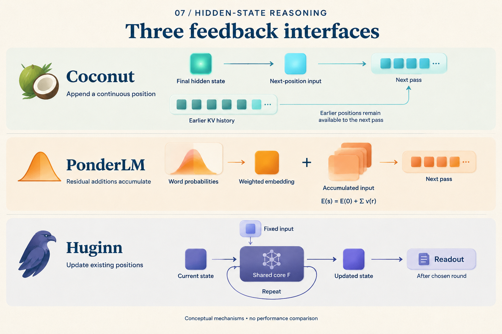

# Where Does the Next Vector Go?

Two models feed vectors back into computation, so both diagrams contain a loop. Give each two more steps: one gains two sequence positions; the other keeps its original positions and updates their states twice.

This changes what the model can read again. A concrete way to understand hidden computation is to **give each vector an address, then track where the next step writes.**

## “Two steps” produces different address tables

For illustration, begin with three processed prefix positions. This is a teaching abstraction, not the tokenization of a real question. Coconut's starting prefix already includes the boundary needed to enter its continuous phase; its ending boundary is outside the two steps counted below.

Each Coconut continuous step appends a position. Another Huginn internal round updates the existing position set:

| Point in execution | Coconut sequence addresses | Huginn state snapshot |
|---|---|---|
| Start | `1, 2, 3` | `s[1,0], s[2,0], s[3,0]` |
| One extra step | `1, 2, 3, 4` | `s[1,1], s[2,1], s[3,1]` |
| Two extra steps | `1, 2, 3, 4, 5` | `s[1,2], s[2,2], s[3,2]` |

*Huginn notation is `s[position,round]`. This compares addressing and updates, not performance on a matched task or FLOP budget.*

On the left, position 4 becomes accessible history. On the right, `s[1,1]` and `s[1,2]` are states of **the same sequence position** at different depths. Round two does not append the entire first-round state as new sequence addresses.

*Look for the new address on the upper right, then the corresponding positions across rounds below. Box counts do not measure memory capacity.*

## What does reading an earlier result involve?

Imagine processing several dependent facts. Appended positions can leave distinct historical addresses; later positions can attend to their keys and values. Coconut's direct feedback supplies the new input while previous KV history remains available. [Coconut v2, Section 3](https://arxiv.org/abs/2412.06769v2)

“Passing one vector” therefore leaves part of its memory undescribed. The current vector and accessible history jointly determine the next computation. Conversely, having address 4 does not establish that it stores one complete fact.

Huginn revises a state matrix with a shared core and fixed prelude condition; during prefill, that matrix covers the original sequence positions. [Huginn v1, Section 3.1](https://arxiv.org/abs/2502.05171v1) Information needed later must remain available through the updated state or accessible caches.

This does not mean every earlier representation disappears. Implementations can retain caches at different layers and depths, and training may save activations for backpropagation. The table says only that another round does not automatically add a latent sequence position to attend to. Incremental generation also need not recompute the entire prefix each round.

Two questions are now separate: **how many sequence addresses exist, and how many transformations each address undergoes.** Both can matter. Comparing capacity requires state width, cache rules, and visibility as well as box counts.

## Another feedback path goes through the vocabulary

Alongside the address, ask how the returned vector is constructed. Coconut uses the final hidden state directly. PonderLM predicts word probabilities, uses them to weight word embeddings, and adds the resulting increment to the existing input. [PonderLM v3, Section 2, Equations 3–7](https://arxiv.org/abs/2505.20674v3)

Calculate a **constructed two-dimensional example with a two-word vocabulary**. Let the embeddings be `A = (1,0)` and `B = (0,1)`, with input `E[0] = (2,2)`. Assign probabilities `(0.75,0.25)` to the first round and `(0.20,0.80)` to the second:

| Update | Weighted embedding increment | Accumulated input |
|---|---|---|
| First | `0.75A + 0.25B = (0.75,0.25)` | `E[1] = (2.75,2.25)` |
| Second | `0.20A + 0.80B = (0.20,0.80)` | `E[2] = (2.95,3.05)` |

These probabilities were chosen for teaching; no model was run. They expose an implementation distinction: the second increment is added to `E[1]`, preserving the first increment. Using `E[0] + second_increment` would instead produce `(2.20,2.80)`, a different update rule.

Each increment is a weighted average of embeddings, lying on the line segment between A and B in this example. The accumulated input need not lie on that segment. A probability-weighted vector and the complete running state are different objects. The paper uses a top-100 candidate approximation in practice, which should be distinguished from the full-vocabulary formula. [PonderLM v3, Section 2, Footnote 1](https://arxiv.org/abs/2505.20674v3)

## Read the three arrows again

*For each row, ask where the vector comes from and where the next computation uses it. The middle plus sign means accumulated increments, not independently executed discrete search branches.*

The interfaces now fit in three rows:

| Interface | What the next computation receives | Main coordinate that changes |
|---|---|---|
| Coconut | Previous position's final hidden state as a new input | Sequence position |
| Huginn | Fixed condition and evolving state | Internal round |
| PonderLM | Accumulated input with a vocabulary-weighted increment | Forward passes within a generation step |

This table does not impose a common cache design or equal step costs. Its purpose is to turn “continue latent computation” into an execution order that can be drawn explicitly.

The two coordinates could also be combined: append `J` latent positions and run `K` core rounds at each. That requires defined training and cache rules, followed by budget-matched experiments. Connecting two arrows alone does not establish a benefit.

The next time a model “thinks for another step in vector space,” write down either `position 4` or `round 2 at position 3`. Once its address is clear, ask where its input comes from and which history remains readable. The loop then describes an actual computation.
