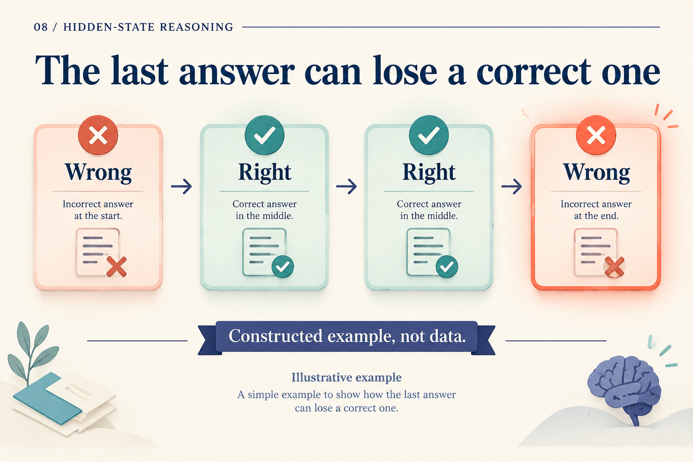
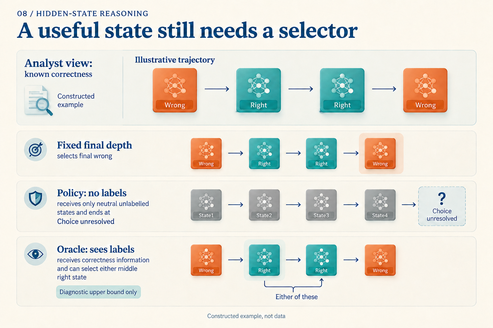

# What if the Model Was Right One Round Ago?

Suppose a question produces this sequence of readouts: **wrong, right, right, wrong**. This is a constructed teaching trajectory. The final readout fails, although an observer with labels can see a correct answer at round two.

A deployed system does not know those correctness labels. It must decide whether to return an answer or run another round using only available signals.

*Correctness is visible to the analyst, not supplied to the stopping policy. These are not recorded model outputs.*

## Separate “stop now” from “exit at this round”

Let `a[r]` be the conditional stopping probability: **given that computation has reached round r, how likely is it to stop now?** Assign `0.2, 0.5, 0.75, 1` to the four rounds. These are also teaching values; setting the final value to 1 assigns all remaining probability to round four.

The second value, 0.5, does not mean half of all requests exit at round two. Twenty percent have already stopped. Only the remaining 80% can reach that round, so its exit mass is `0.8 × 0.5 = 0.4`.

Continue the calculation. **Reach** is the probability of reaching the round; **Stop** is the conditional probability of stopping there. **Exit** is their product, the probability of exiting at that round. **So far** sums Exit through the current round.

| Round | Reach | Stop | Exit | So far |
|---|---:|---:|---:|---:|
| 1 | 1 | 0.2 | 0.2 | 0.2 |
| 2 | 0.8 | 0.5 | 0.4 | 0.6 |
| 3 | 0.4 | 0.75 | 0.3 | 0.9 |
| 4 | 0.1 | 1 | 0.1 | 1 |

Round three receives `0.8 × 0.5 × 0.75 = 0.3`: survive the first two rounds, then stop. In general:

`q[r] = a[r] × ∏(1 − a[j]), for j < r`

The resulting `q = (0.2, 0.4, 0.3, 0.1)` is a distribution over exit rounds. Ouro constructs a cumulative distribution from conditional stopping probabilities and applies an exit threshold. [Ouro v1, Section 3.2, Algorithm 1](https://arxiv.org/abs/2510.25741v1)

## One distribution, different decision rules

With the rule “exit once cumulative mass reaches 0.8,” round two's 0.6 is insufficient; round three's 0.9 crosses the threshold. Raising the threshold to 0.95 selects round four. In our invented trajectory, the longer computation selects a wrong answer.

Alternatively, actually sample an exit round from `q`. Its expected depth is:

`1 × 0.2 + 2 × 0.4 + 3 × 0.3 + 4 × 0.1 = 2.3`

The correct rounds receive combined probability `0.4 + 0.3 = 0.7`. This 70% is a calculation for random selection on an invented trajectory, not benchmark accuracy. The 0.8-threshold rule deterministically runs three rounds; 2.3 is not its cost.

ACT uses halting values differently. Given the same first three values, `0.2, 0.5, 0.75`, use the paper’s experimental threshold `1 − ε = 0.99` (`ε = 0.01`). The sum is 0.7 after round two and 1.45 after round three, first crossing the threshold there. The final mixing weight becomes the remainder, 0.3, producing `0.2s[1] + 0.5s[2] + 0.3s[3]`. This mixes states rather than sampling one. ACT also penalizes computation. [ACT v6, Sections 2–2.1](https://arxiv.org/abs/1603.08983v6)

A “stopping probability” therefore needs an execution rule: sampling, cumulative thresholding, or state mixing. A finite budget also needs a tail convention and forced termination. Our example makes that explicit through `a[4] = 1`.

## Can real models get worse with more rounds?

Ouro v1 Table 10 reports the 1.4B base model's MMLU five-shot average dropping from **67.45** at four rounds to **64.49** at eight. More rounds do not necessarily help in this setting. Table 5 lists earlier eight-round training, conflicting with Section 5.3's maximum-four-round description; we therefore do not call depth eight previously unseen. [Ouro v1, Tables 5 and 10, Section 5.3](https://arxiv.org/abs/2510.25741v1)

An aggregate table still cannot tell a deployed system when to stop on each question. Two abilities need separate evaluation: producing a useful answer somewhere on a trajectory, and selecting it.

## Having an answer to choose is not choosing it

Fix the computation and cache rules that produce a full trajectory. An oracle with correctness labels can inspect every round within the budget, counting success if any answer is correct. An actual policy selects a round using signals without labels.

*The oracle uses information unavailable to the policy. Its bound applies to the same selectable trajectory, not a trajectory produced by different cache or generation rules.*

In our opening example, the oracle succeeds while final-depth selection fails. For “wrong, wrong, wrong, wrong,” no selector can recover a correct state.

A stochastic-stopping study compares oracle and policy accuracy on Unique Set. It also notes that a small gap can mean a model is consistently wrong, so the gap must be read alongside policy accuracy. [Stochastic Stopping v1, Appendix C.3](https://arxiv.org/abs/2606.29983v1)

This diagnosis changes what to improve. Frequently available correct states motivate better selection. Rare correct states instead motivate better training or updates. *End-to-end Algorithm Synthesis* studies restarting from randomly reached intermediate states, detaching the early history, and supervising subsequent progress alongside a full-unroll loss on its algorithmic tasks. [Paper v3, Sections 3.1–3.3](https://arxiv.org/abs/2202.05826v3)

## Make the decision without test labels

Low entropy, unchanged answers, and small state changes can supply stopping signals. Confidence and the value of further computation are different targets. Ouro's dedicated gate-training phase uses improvement in adjacent-depth task losses as supervision; inference relies on the gate's prediction. [Ouro v1, Section 3.4](https://arxiv.org/abs/2510.25741v1)

A deployable comparison can begin with one checkpoint. Choose a fixed depth and stopping threshold on validation data, freeze both decisions, and compare on held-out tests:

| Comparison | Question it answers |
|---|---|
| Fixed depth | What quality and latency are achievable without an extra selector? |
| Actual stopping policy | Without test labels, is the saved work worth the accuracy change? |
| Same-trajectory oracle | How many correct answers appeared but were missed by the policy? |

With token-specific depths, early exits can change the cache entries available to later positions. Mixture-of-Recursions jointly designs routing and cache rules for this reason. [Mixture-of-Recursions v3, Section 2.2](https://arxiv.org/abs/2507.10524v3) Latency measurements must include those execution details; average rounds alone are insufficient.

The opening trajectory has no unique deployment answer because we deliberately supplied no usable signal for recognizing correctness. It separates the goals: produce states worth selecting, then learn a label-free rule that returns an appropriate one in time.
