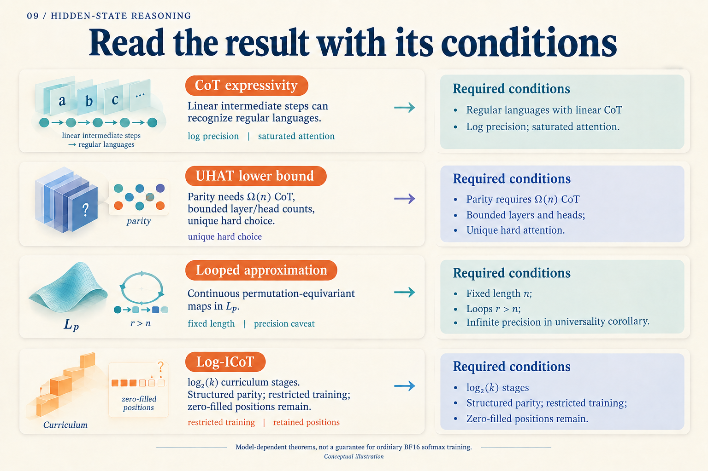

# What Does It Mean to Prove That a Model Can Compute?

Take the four bits `1, 0, 1, 1`. Do they contain an odd or even number of ones? The answer is odd. We will use this teaching example to separate solving a problem from proving something about a Transformer.

One algorithm keeps a single bit of state, initially zero. Reading a one flips the state; reading a zero leaves it alone:

| Input bit | New state |
|---|---:|
| 1 | 1 |
| 0 | 1 |
| 1 | 0 |
| 1 | 1 |

The final one means odd. Another algorithm first computes two pairs in parallel: `1 XOR 0 = 1` and `1 XOR 1 = 0`. It then combines them: `1 XOR 0 = 1`. The first algorithm advances through the sequence. The second uses a tree to reduce sequential depth. These are hand-written algorithms; we have not trained a network.

Already, “how many steps does parity require?” needs a qualification: what kind of computation is allowed?

## Three different meanings of “can”

Suppose inputs always have length four. There are only 16 of them. A complete lookup table would solve the task. Showing that a model can hold that table answers one question: **does the model class contain a correct solution?**

Now initialize its parameters randomly and train on some examples. Whether the optimizer finds a correct solution is another question. The existence of a table does not explain how training reaches it.

Finally, give the model eight bits. A table for four-bit inputs no longer suffices. The parity update rule can keep running. Determining which solution the model learned needs further evidence: perfect answers on all 16 four-bit inputs do not distinguish a table from a reusable rule.

*The model class, optimization path, and changed test conditions require different evidence. The pictured optimization path is conceptual.*

There is also a difference between “for every length, there exists a suitable parameter setting” and “one parameter setting works for every length.” The first permits redesigning the model when length changes. The second asks the same system to continue working. The order of “for every” and “there exists” can carry much of a theorem's meaning.

## Why the attention rule matters

Merrill and Sabharwal study Transformers with intermediate decoding. Their construction uses a linear number of intermediate steps to recognize any regular language; parity is one example of a regular language. This is an existence construction: parameters are designed for the target algorithm, rather than guaranteed to emerge from ordinary pretraining. [Paper v5, Theorem 1](https://arxiv.org/abs/2310.07923v5)

The construction uses logarithmically growing precision, saturated attention, and projected pre-norm. Saturated attention averages over positions tied for the highest score; projected pre-norm allows normalization after a projection. Their stronger Turing-machine simulation also requires strictly causal masking. The claimed strict separation from models without intermediate steps retains the corresponding complexity-class non-collapse assumption. These conditions define the machine to which the result applies. [Section 2.1 and Theorems 1–2](https://arxiv.org/abs/2310.07923v5)

Change the machine, and read the claim again. A UHAT attention head selects one position, resolving tied scores by a fixed rule. Bavandpour and colleagues prove that parity requires a CoT of length `Ω(n)` in this model family when layer and head counts are uniformly bounded. Width need not remain fixed, and the model may vary with length. [ICML 2025, Definition 2.2 and Theorem 4.2](https://proceedings.mlr.press/v267/bavandpour25a.html)

Here `Ω(n)` is a scaling lower bound: for sufficiently long inputs, chain length must be at least a positive constant times input length. It does not say that four bits require exactly four generated tokens, or establish a bound for every softmax Transformer.

Why not simply argue that one head reads one bit, so it must read n times? Because **the selected position itself depends on the input**. Selection can carry information. The proof must account for that indirect channel. A teaching algorithm gives intuition about computation; it does not replace a lower-bound proof.

## What is allowed to change in universal approximation?

A looped model repeatedly uses the same module. Xu and Sato ask which functions this architecture can approximate. Their result concerns fixed-length inputs and continuous permutation-equivariant maps on a compact domain, with error measured in an `Lᵖ` norm and more loops than sequence positions. [ICML 2025, Theorem 3.6](https://proceedings.mlr.press/v267/xu25x.html)

Permutation equivariance means that rearranging input positions rearranges the outputs in the same way. It specifies a class of functions. Fixed length means the proof operates within a particular input space; moving to longer sequences is a further question.

The universality corollary permits infinite-precision weights, and the theoretical architecture excludes layer normalization. It describes the capacity of a model class. It does not promise that another iteration improves a particular trained BF16 model. The paper proposes timestep encoding as an enhancement; extrapolation in depth remains something to test separately. [Section 2.1, Corollary 3.7, and Section 4](https://proceedings.mlr.press/v267/xu25x.html)

## A theorem that does address learning

Log-ICoT moves to the training question. For tree-structured `k`-parity, it removes intermediate supervision by tree level over `log₂(k)` stages. With four participating bits, the tree has two combination levels: combine leaf pairs, then combine their outputs. This small example explains the curriculum hierarchy, not the theorem's sample requirements. [Paper v1, Sections 3.1–3.3](https://arxiv.org/abs/2605.28600v1)

The guarantee comes with a specified architecture and optimizer. The trainable attention part depends on positional encodings; the value map is fixed. The construction also uses a specialized link function, gates, a tree-level mask, block shifts, and quantized updates, with constraints on batch size, initialization, learning rate, and gradient precision. Those choices make it possible to analyze how training internalizes computation across layers.

At inference, the original CoT positions remain, filled with zeros. One forward pass removes sequential generation of intermediate tokens while retaining computation over those positions. [Section 3.1, Evaluation](https://arxiv.org/abs/2605.28600v1)

*Use this as an index after reading the explanation. Each row omits technical conditions; applying a result still requires its theorem statement.*

Return to `1, 0, 1, 1`. We know how to compute its parity. For a neural model, three investigations remain distinct: establish that the model class contains a solution, explain how training reaches one, and test whether the same parameters work at new lengths. When a claim says that a model “can reason,” translate it into one of those questions, then inspect the time, space, precision, and training information it allows.
