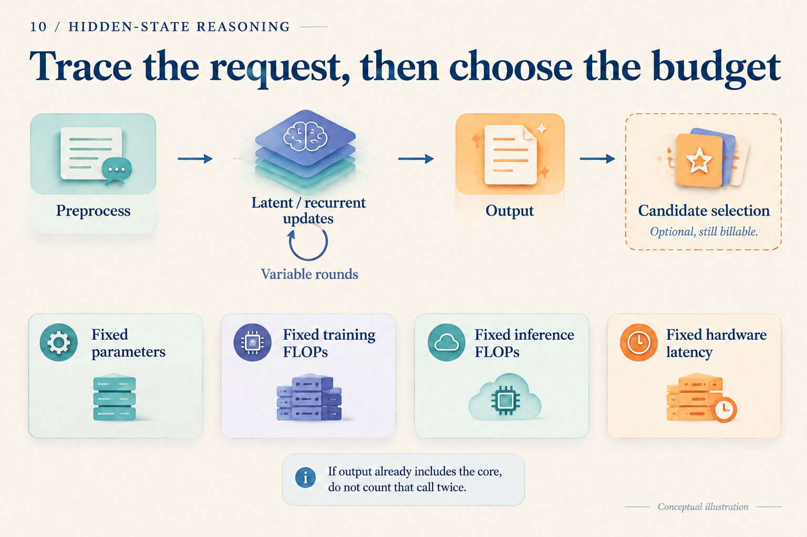

# Eight Fewer Tokens: How Much Computation Did We Save?

Two systems answer the same question. A writes eight reasoning tokens and two answer tokens. B performs four continuous steps internally, then writes only two answer tokens. B looks much shorter. Does its computational bill shrink by the same amount?

Start with a **wholly hypothetical teaching ledger**. Every cost below is assigned for this example, not measured from a model or derived from its FLOPs. The unit U denotes the same normalized amount of operations throughout; it cannot be converted into milliseconds. Each call's assigned cost includes its required attention, cache reads, and readout. To keep the arithmetic simple, calls of the same kind cost the same over this short request.

## Count the calls first

Preprocessing costs 12 U in either system. Each generation step in A costs 2 U. A continuous step in B costs 3 U, and an answer step costs 2 U. Each produces one candidate with no additional selector.

| Item | A: written chain | B: continuous chain |
|---|---:|---:|
| Preprocessing | 12 | 12 |
| Intermediate work | 8 × 2 = 16 | 4 × 3 = 12 |
| Answer generation | 2 × 2 = 4 | 2 × 2 = 4 |
| Total | 32 U | 28 U |

B removes eight visible tokens but saves only `32 − 28 = 4 U`, or 12.5% of A's total. Four more expensive internal calls replace eight cheaper text calls. Output length is not the unit of this ledger.

Change one assumption: B needs a verifier costing another 6 U. Its total becomes 34 U, exceeding A's 32 U. Alternatively, increase B's continuous-call cost from 3 U to 4 U. Even without a verifier, B then reaches 32 U. The arithmetic shows why reconstructing execution comes before comparing generated length.

We have assigned no accuracy to either system. This ledger teaches accounting; it does not recommend a system. A real comparison must put answer quality beside the bill.

*The three illustrated calls show a structure, not either call count in the table. Weights may be stored once while every use still incurs computation.*

## Replace the toy entries with actual execution

Real call costs depend on context length, caching, precision, and routing. A useful accounting abstraction is:

`request work = preprocessing + intermediate updates + answer generation + candidate selection`

In symbols:

`F = Fpre + Σⱼ rⱼ Fcore(nⱼ) + Σᵢ Fout(nᵢ) + Fselect`

Intermediate position j invokes the core `rⱼ` times with accessible context length `nⱼ`. The output term accumulates answer-generation steps. This groups calls; it is not an exact FLOPs formula from a particular paper. If an output call already includes the recurrent core, count that work in only one term. Include visual encoding, retrieval, and judging wherever the implementation actually performs them.

CODI's student produces continuous states before its answer, while the teacher task and activation alignment contribute to training. TRM reuses a small network to update latent and answer representations. Each requires accounting along its own computation graph; neither output length nor parameter count determines the bill. [CODI v3, Section 3](https://arxiv.org/abs/2502.21074v3), [TRM v1, Figure 3](https://arxiv.org/abs/2510.04871v1)

Caching is easy to omit. Keeping old keys and values avoids recomputing history but incurs storage and reads. Representations at different depths need not share an interchangeable cache. Log-ICoT offers another useful example: its theoretical inference setup retains zero-filled CoT positions. Avoiding generation of those tokens does not remove computation at those positions. [Log-ICoT v1, Section 3.1, Evaluation](https://arxiv.org/abs/2605.28600v1)

## Why measure time after counting operations?

Return to 32 U and 28 U. Estimating time in that ratio would require equal effective operation rates and no other overhead. Sequential dependencies, small-kernel launches, memory bandwidth, and batching can change those rates on actual hardware.

If B's four steps form a dependent chain, each waits for its predecessor. Another strategy for A might generate several independent candidates concurrently. Total work and completion time can move in different directions. Whether fewer operations make the answer arrive sooner must be measured on the intended hardware.

The measurement boundary matters too. Request arrival to the first answer token differs from arrival to the complete answer. Fix precision and batch size; report warm-request latency, tail latency, and throughput, with cold start separately. Account for asynchronous GPU execution so that finishing submission of work is not mistaken for finishing the work itself.

*The upper path helps complete the bill. The lower row identifies comparison questions; these four budgets usually cannot all be matched simultaneously.*

Fixed parameters ask about value at a storage scale. Fixed training FLOPs ask what an equal investment can produce. Fixed inference FLOPs compare how requests use computation. Fixed hardware latency includes implementation efficiency. Choose the primary constraint and disclose differences in the others.

## Can training change the decision?

Suppose B requires an extra 4,000 U of training and then saves exactly 4 U per request. These remain invented values in the same teaching ledger. After N requests, the extra training is offset when:

`4,000 = N × (32 − 28)`

Thus `N = 1,000`. Before one thousand requests, B has not recovered its additional training work. Afterwards, it begins saving this measure of work. Add the earlier 6 U verifier, and B costs more per request: there is no positive break-even point. This is still not a financial calculation; training and serving hardware may have different unit prices.

Real training needs its forward passes, backward passes, and repeated supervision counted. TRM's Figure 3 separates recursion without gradients from recursion with gradients; both perform forward work. HRM's gradient approximation and deep supervision also shape the training path. [TRM v1, Figure 3 and Section 4.1](https://arxiv.org/abs/2510.04871v1), [HRM v3, gradient approximation and deep supervision](https://arxiv.org/abs/2506.21734v3)

When methods share a base checkpoint, incremental training cost can be reported separately. With different starting points, state the known training histories and unknown items. Generating teacher traces once and caching them differs from generating them online for every batch.

Finally, save answers and costs for the same held-out questions. Keep every question in the denominator, including parsing failures and timeouts; choose thresholds and checkpoints on validation data. Sweeping a fixed checkpoint's budget asks whether that system can use more computation. Retraining at every budget asks a different question. A reproducible claim should be reconstructible from the model, data, call logs, and timing boundaries, just as the opening ledger can be reconstructed from its entries.
