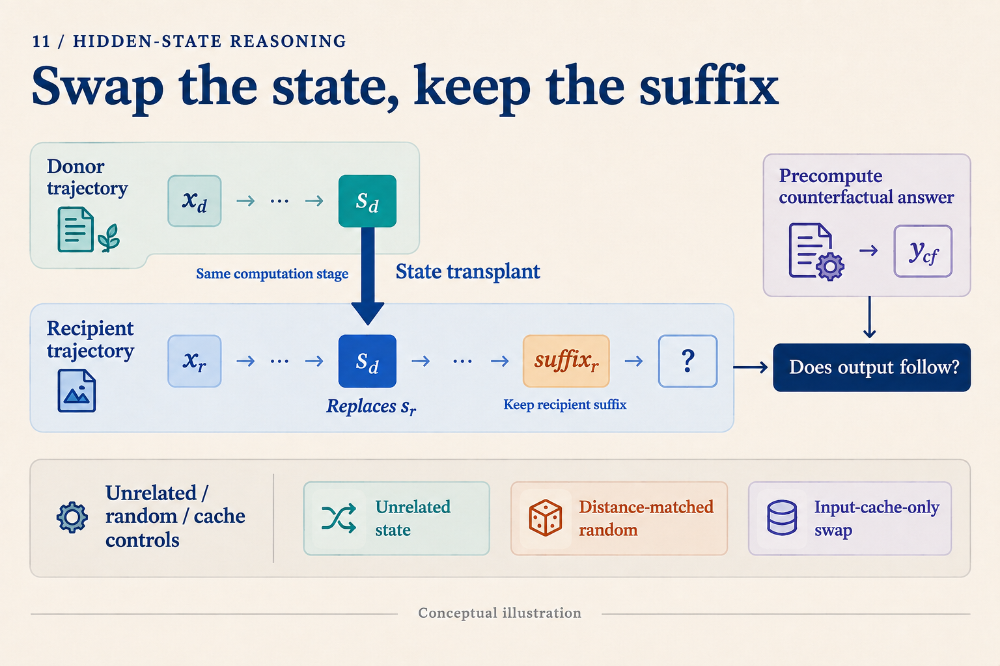

# You Decoded 36 from a Hidden State. What Comes Next?

Three boxes contain twelve parts each, and four parts are damaged. How many remain? We compute `3 × 12 = 36`, then `36 − 4 = 32`. Suppose a researcher decodes 36 from a model's hidden state and sees the model answer 32. Does that establish that the model multiplied first, then used 36 in a subtraction?

An experiment is still missing. We will use this **constructed teaching problem** to explain why. No model has been run here, and no vector is assumed to have actually encoded 36.

## Who did the computation: the model or the probe?

A researcher can train a small network to map a hidden state h to an intermediate answer. This network is a probe. Writing `q(h) ≈ 36` says that q can recover 36 from h.

Perhaps h already contains the multiplication result. Perhaps it retains the inputs 3 and 12, and the probe performs the multiplication. Or perhaps 36 is present but the main model reaches 32 through another path. All three possibilities allow a correct probe answer.

*Follow the upper path to ask what can be recovered, then the main path to ask what the answer depends on. The dashed bypass is a candidate explanation to investigate.*

Probing therefore helps locate information. Train and evaluate probes on separate data, choose capacity on validation data, and include a capacity-matched probe that sees only the original input. If that probe also obtains 36, its own computational ability matters. A logit lens borrows a vocabulary readout; an attention map displays routing weights. Each has a limited view. A compelling heatmap does not by itself establish causal use.

## Make “used 36” predict a different answer

Prepare a second problem: five boxes, eight parts each, seven damaged. Its intermediate result is 40 and its answer is 33. Two natural runs could now supply candidate activations:

| Run | Product | Next operation | Original answer |
|---|---:|---|---:|
| Recipient A | 36 | Subtract 4 | 32 |
| Donor B | 40 | Subtract 7 | 33 |

Imagine replacing one activation in A with B's activation at the same candidate computation stage, while preserving A's later subtraction of four. If that activation carries an intermediate number available to subsequent computation, the new prediction should be:

`40 − 4 = 36`

This differs from both A's original answer, 32, and B's original answer, 33. That matters: if the expected result were the donor's answer, copying a completed answer would be harder to exclude.

This is counterfactual continuation. Compute the answer implied by changing the intermediate value before examining the intervened model output. The expected 36 comes from arithmetic, not from an observed model run.

*The diagram separates what changes, what stays, and what is predicted. Its state symbol does not assume a vector contains only one scalar.*

An implementation must specify the replaced object: layer, position, residual stream or component, and whether downstream caches are recomputed. Match input lengths and positional conventions too. Transplanting an entire cache cannot be interpreted as an effect of one isolated vector.

Repeat the test across prefixes and later operations. For example, transplant a candidate representation of 40 while asking for subtraction of four or six. The predicted answers become 36 and 34. A state that supports the recipient's different operations offers more specific evidence for a reusable intermediate value.

## Controls that challenge simpler explanations

Start with self-replacement, which changes nothing. If it damages output, investigate the implementation. Next, find a different prefix with the same intermediate value, 36, and transplant its state into A. The intermediate-value hypothesis predicts 32 again. This tests representational compatibility rather than proving causal use on its own.

Then compare three interventions: an unrelated state at a matched stage, a random perturbation whose norm matches the replacement difference `h_B − h_A`, and replacement of input caches without replacing the candidate activation. If semantically appropriate replacements selectively produce the counterfactual answers, the result is more informative than a generic response to damage. If cache-only replacements produce the same effect, investigate an input bypass.

Failure remains ambiguous. A donor activation combined with recipient caches may create a state never encountered during training. If every transplant fails, this intervention did not establish continuation. The location may be wrong, information may be distributed, or the combined representations may be incompatible. Such a result does not establish the absence of intermediate computation.

## What has an actual mechanism study found?

*Do Latent-CoT Models Think Step-by-Step?* studies modular polynomial iteration, not the parts problem above. Using a small GPT-2-style CODI model, it combines probes, logit lenses, attention analysis, and activation patching. On short-hop tasks, intermediate bridge states and a near-direct final-input path contribute to answer formation. At greater hop counts, the diagnosed latent pathway concentrates more on late intermediates. [Paper v1, Sections 3–4 and Appendices C–D](https://arxiv.org/abs/2602.00449v1)

There is considerable room between containing intermediate information and implementing a complete step-by-step trace. The findings belong to the studied model, tasks, training protocol, and diagnostic tools. Failure to decode a step may also reflect a readout's limitations. The modular task's algebra does not automatically describe natural-language reasoning. Our numerical transplant and controls above are a teaching design, not experiments reported in that paper.

The question also applies to vision. MCOUT-Base feeds back a final hidden state; MCOUT-Multi combines it with multimodal embeddings to produce thought embeddings appended to the sequence. [MCOUT v2, Sections 3.1–3.2](https://arxiv.org/abs/2508.12587v2) To investigate late use of visual evidence, keep question text fixed, change the visual relation determining the answer, and compare early and late interventions. Reading existing embeddings again differs from rerunning the visual encoder.

Architecture names deserve the same scrutiny. HRM's high- and low-level modules are Transformer modules with different update frequencies; their names alone do not establish a planning/execution division. [HRM v3, architecture details](https://arxiv.org/abs/2506.21734v3) TRM reuses a small network to update latent state z and answer representation y. That structure supplies intervention sites, while their function still needs tracing. [TRM v1, Figure 3 and Section 4.1](https://arxiv.org/abs/2510.04871v1)

The next time a probe recovers 36, treat it as a lead. A stronger next step is to change the relevant information and observe the pre-specified continuation, selectively relative to matched controls. The goal is to explain a pathway through the computation, beyond giving a vector an intuitive label.
