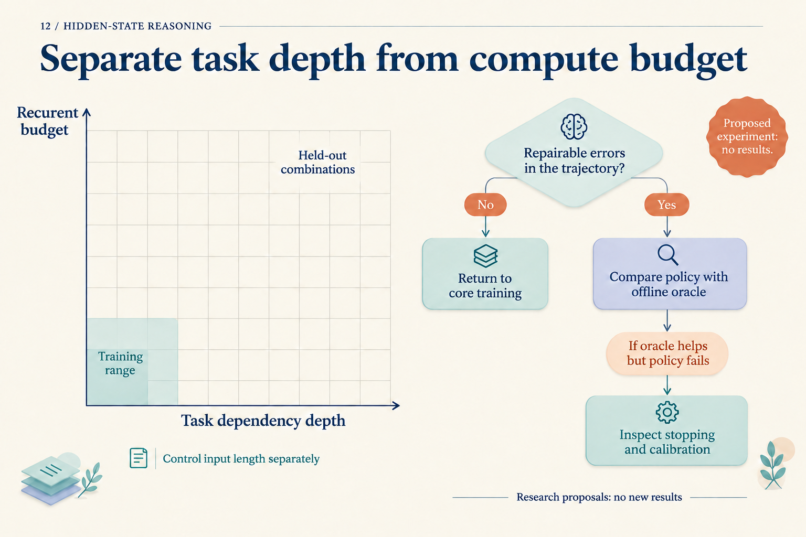
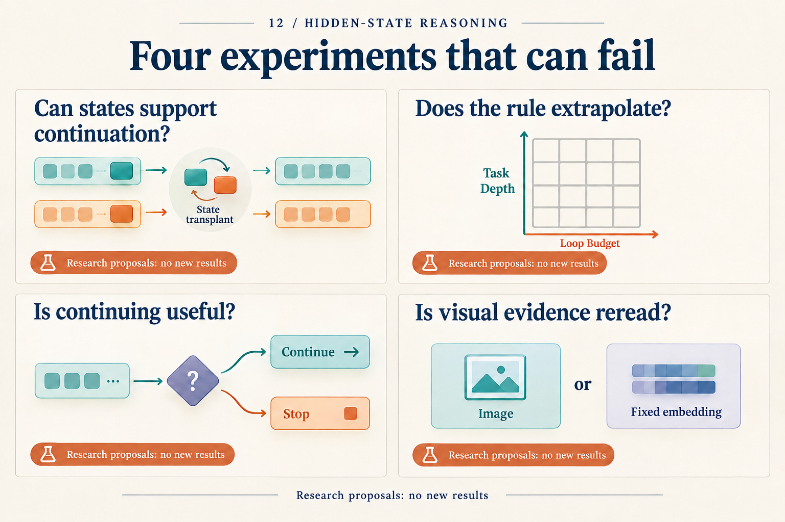

# An Experiment That Could Reject a Hidden-State Hypothesis

A model becomes more accurate when it runs for more steps. That observation is worth investigating. It does not yet identify the cause: perhaps the model learned a reusable update, or perhaps its answer becomes readable only at a particular endpoint.

Narrow the claim to a testable hypothesis: **a candidate hidden state carries an intermediate result that later computation can use with a new suffix of operations.** What follows is an unexecuted research proposal. Every numerical example comes from a constructed arithmetic task, not a new model measurement.

## Compute the answer outside the network first

Use a small modular task. The input provides an initial state `s₀`. Each step reads multiplier `xₜ`, multiplies the previous state, adds one, then takes the remainder modulo eleven:

`sₜ = (sₜ₋₁ × xₜ + 1) mod 11`

Initial states range from zero to ten; multipliers range from one to ten. A fixed prime modulus and nonzero multipliers make every update one-to-one in the preceding state. Distinct intermediate values therefore remain distinct under the same suffix. This algebraic property avoids uninformative interventions whose changed intermediate value must produce the same answer.

The task is inspired by a CODI mechanism study in which bridge states, input bypasses, and information contraction can coexist. Our modulus, paired inputs, and intervention below are a separately proposed design. [Mechanism study v1, Sections 3–6](https://arxiv.org/abs/2602.00449v1)

Prepare two three-step problems:

| Item | Recipient A | Donor B |
|---|---|---|
| Input | s₀=2; multipliers 3,2,4 | s₀=1; multipliers 5,3,4 |
| Step 1 | 2×3+1 → 7 | 1×5+1 → 6 |
| Step 2 | 7×2+1 → 4 | 6×3+1 → 8 |
| Answer | 4×4+1 → 6 | 8×4+1 → 0 |

*Every value after an arrow is reduced modulo eleven. For example, fifteen leaves remainder four and thirty-three leaves zero. These are exact task trajectories, not observed hidden-state trajectories.*

Replace A's first intermediate value, seven, with B's value, six, while preserving A's remaining multipliers, two and four. The counterfactual calculation is:

```text
Transplanted starting value: 6
Next:  (6 × 2 + 1) mod 11 = 2
Final: (2 × 4 + 1) mod 11 = 9
```

Nine differs from the recipient's original answer, six, and the donor's original answer, zero. Producing nine fits intermediate-value continuation better than copying the donor's answer. Merely changing the output would not suffice.

## Decide which network object to replace

Select a fixed architecture with continuous-state feedback and record its input serialization, latent-step count, and caching rules. Train an answer-supervised baseline and a version with endpoint distillation, matching the base model, training problems, and training compute; disclose any unmatched costs. Keep these choices fixed in the first study instead of searching several architectures at once.

The model sees the complete problem. An early latent position may therefore contain future inputs or an answer already computed. Calling it the “first hidden step” does not make it the first task state in the table. Locate a candidate on independent validation data with a fixed-capacity probe for `s₁`, then freeze the layer, position, replacement tensor, and scoring rule. Do not select the best location separately for each test problem.

Replace only the selected activation. Preserve recipient inputs and other existing caches, and recompute downstream operations that depend on the replaced activation. If the implementation requires replacing a set of layer caches to influence continuation, name that set as the intervention object and add a single-activation control. Logs should make the operation replayable.

The question moves from “where can we decode six?” to “does transplanting that object produce nine?” This does not require every latent step to mirror a hand-written step. If no suitable candidate can be located, the proposed intermediate-state hypothesis lacks support.

## Set controls and failure conditions before results

For the same recipients, run self-replacement, replacement from a different prefix with the same intermediate value, replacement with a different intermediate value, random perturbation with norm matched to `h_B − h_A`, and input-cache-only replacement. Match sequence length, candidate stage, and positional conventions. Self-replacement should reproduce the original run; same-value replacement checks compatibility; random perturbations test generic fragility; cache controls investigate bypasses. For the different-value donor group, retain only pairs whose counterfactual, recipient-original, and donor-original answers are pairwise distinct, so the output categories below do not overlap. This filter does not apply to same-value donor controls.

Use more than the single A/B pair. Group data by the complete prefix `(s₀,x₁)` before assigning training, validation, and test splits, keeping variants of a prefix together. Balance intermediate-value and answer frequencies where feasible, and report selection bias remaining after pair filtering. Restricting to pairs whose original problems are both answered correctly helps diagnosis but removes hard cases. Report counts and outcomes for all eligible pairs as well as that conditional subset.

The primary outcome is the fraction of different-value transplants producing the **precomputed counterfactual answer**. Also report recipient-original answers, donor-original answers, and other outputs. Use the same recipients for every control. Set seeds, training limits, the smallest effect of interest, and interval-estimation method before the final test. Estimate variance on separate pilot samples to choose the final sample size; do not recycle pilot samples into the test set.

| Possible observation | Interpretation |
|---|---|
| Different-value swaps selectively follow the counterfactual; same-value swaps remain stable | Supports local continuation through this state on these problems |
| Probe accuracy is high, but outputs do not follow counterfactuals | Passive storage, bypasses, or incompatible interventions remain possible |
| Self-replacement changes the answer | Investigate implementation or randomness control first |
| Real swaps and random perturbations are similarly disruptive | No semantically specific causal evidence yet |
| Continuation holds only on very short tasks | Local use is supported; longer composition remains unresolved |

The table specifies how to interpret future outcomes. It does not predict which row will occur. In particular, an incompatible donor state and recipient cache can make a transplant fail. Such failure does not refute every form of internal reasoning. The falsifiable claim concerns **this location, this representation, and these suffix operations**.

## Expand only after the small test is informative

First test same-length continuation on unseen prefixes. Then vary task update count and model latent-step count independently. One axis increases problem difficulty; the other supplies more computation. Testing only longer problems with larger budgets confounds them. Stratify by input length and retain controls without increased budgets.



*This figure concerns later extensions. Its recurrent-budget axis applies to recurrent-depth models; our continuous-feedback study should record latent steps instead. The units are not interchangeable. Blank cells contain no measurements.*

Theory can suggest further variables. Looped-approximation work considers timestep modulation, while Log-ICoT analyzes learning under a structured curriculum. They motivate comparisons of timestep information and supervision; they do not guarantee this experiment will extrapolate. [Looped theory, Sections 3–4](https://proceedings.mlr.press/v267/xu25x.html), [Log-ICoT v1, Section 3](https://arxiv.org/abs/2605.28600v1)

For a stopping study, first save the fixed core's answer trajectories and establish whether useful earlier answers exist. Then train a selector that cannot see labels. HRM and TRM supply examples of update and halting designs; an offline selector with correct labels provides a diagnostic upper bound, not a deployable policy. [HRM v3](https://arxiv.org/abs/2506.21734v3), [TRM v1, Sections 2.5 and 4.6](https://arxiv.org/abs/2510.04871v1)

Vision comes later. MCOUT gives continuous states access to multimodal embeddings, suggesting comparisons among initial-only visual input, repeated reading of fixed embeddings, and fresh encoding of local image regions. Charge for extra encoding. [MCOUT v2, Sections 3.1–3.2](https://arxiv.org/abs/2508.12587v2) These remain proposals and should not displace the first study's controls.



*The article develops the upper-left question into a complete test. The remaining cards locate possible later studies.*

The design's value does not depend on the model producing nine. If it fails, we can investigate implementation, compatibility, and missing evidence for continuation separately. If it succeeds, the next questions about prefixes, lengths, and suffixes are explicit. A small, interpretable failure can guide the next experiment more precisely than an unexplained aggregate score.
