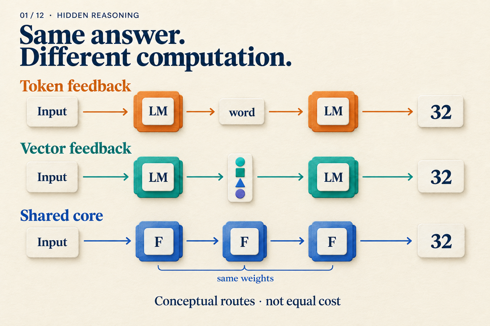

# What Happens Before a Model Gives Its Answer?

## Post copy

The same answer, 32, can follow different computation paths. Trace token feedback, vector feedback, and recurrent depth through one problem: what is passed forward, what runs again, and who sets the number of rounds?

## Attachment and alt text

Image: `assets/01/cover.en.png`

Alt text: Three teaching paths reach 32: token feedback, direct vector feedback, and repeated shared-core updates. Arrows do not imply equal computation.

