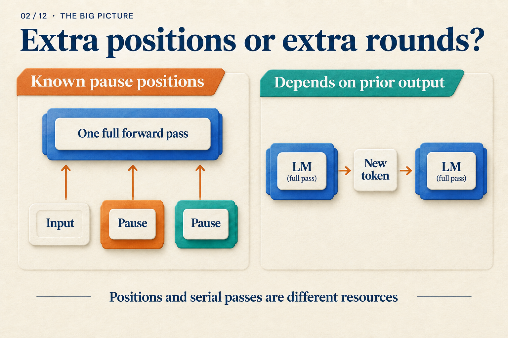

# Why Aren't Three Pause Tokens Three Reasoning Steps?

## Post copy

Three pause tokens are not three generated reasoning steps. Trace what the last pause can read in a two-layer model, then locate the waits in generation. Equal position counts can hide different dependencies.

## Attachment and alt text

Image: `assets/02/cover.en.png`

Alt text: Known pause positions enter one model stack together. On the other side, each generated token determines a later input, creating sequential waits.

