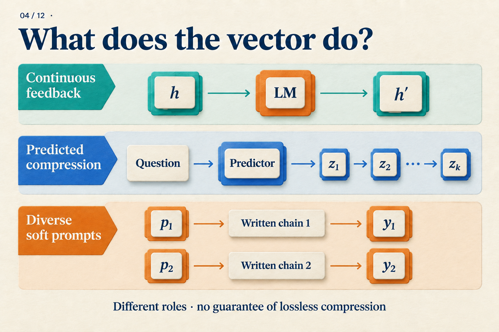

# How Does a Model Keep Computing Without Writing the Steps?

## Post copy

How can a model keep computing without writing the steps? Follow a two-step arithmetic example through Coconut’s hidden-state feedback and training curriculum, then look at its math and logic results.

## Attachment and alt text

Image: `assets/04/cover.en.png`

Alt text: Three uses of continuous representations: feedback from the previous hidden state, predicted compressed teacher states, and soft prompts for later written reasoning.

