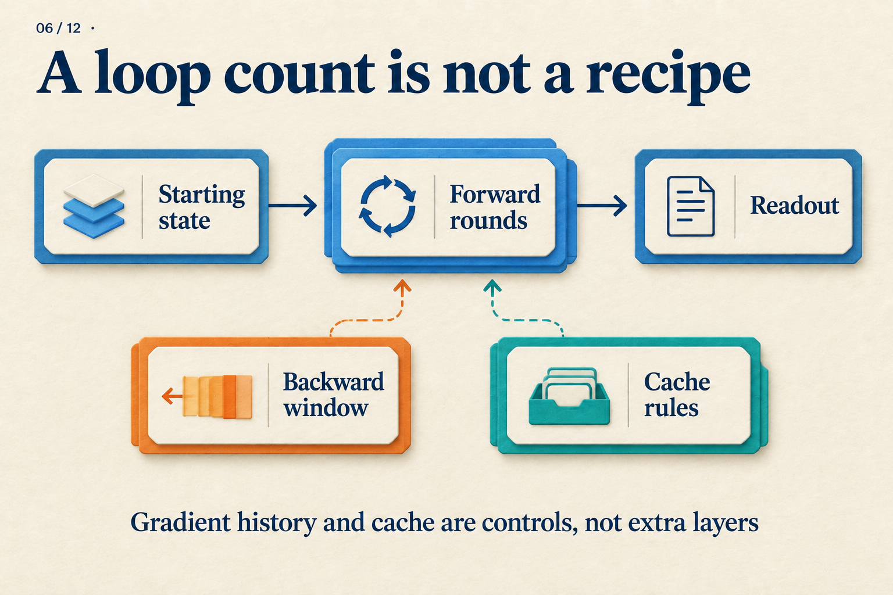

# Four Forward Rounds, but Only Two Backward?

## Post copy

Four forward rounds can produce the same answer with different gradients. Work through a scalar example, then connect forward depth, backward windows, and readout losses to recurrent language models.

## Attachment and alt text

Image: `assets/06/cover.en.png`

Alt text: A recurrent training recipe separates starting state, forward rounds, backward window, readout, and cache access.

