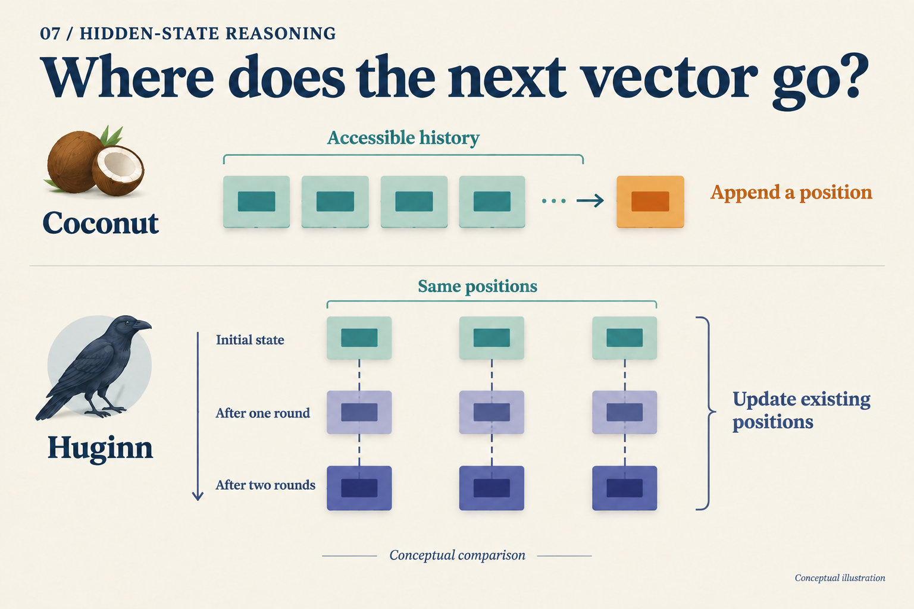

# Where Does the Next Vector Go?

## Post copy

Give each vector an address. Coconut appends positions; Huginn updates existing ones. A worked PonderLM example adds another distinction: vocabulary-weighted increments accumulate.

## Attachment and alt text

Image: `assets/07/cover.en.png`

Alt text: Two organizations of computation: Coconut adds latent positions to accessible history; Huginn updates states at existing positions.

