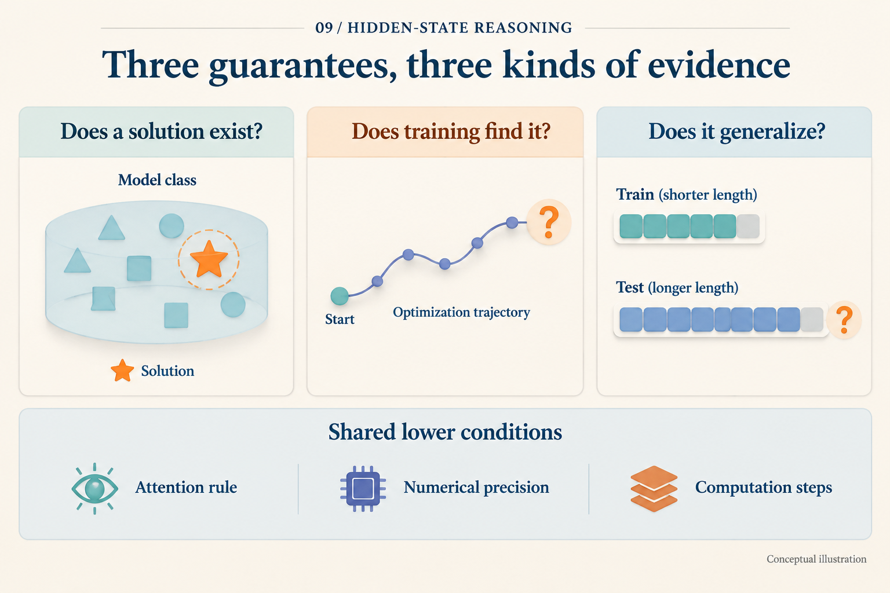

# What Does It Mean to Prove That a Model Can Compute?

## Post copy

Four-bit parity can be solved by a table or a reusable rule. Perfect answers on all 16 inputs do not distinguish them. Read model theory by separating existence, learning, and generalization, then checking the allowed resources.

## Attachment and alt text

Image: `assets/09/cover.en.png`

Alt text: Three separate gates ask whether a solution exists, training finds it, and it survives a shift; resource labels identify precision, steps, and attention.

