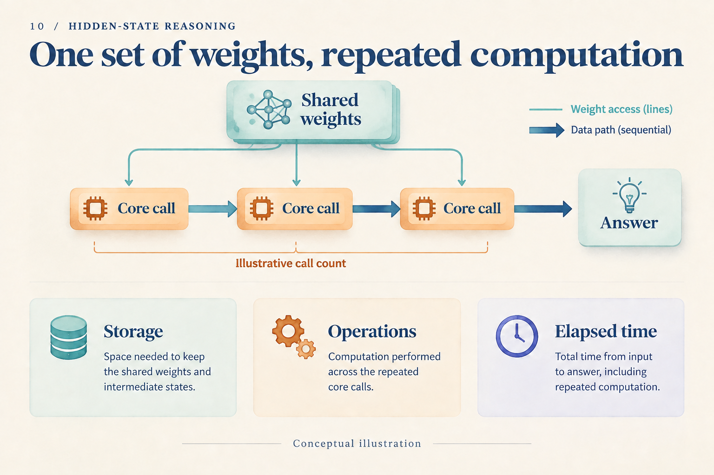

# Eight Fewer Tokens: How Much Computation Did We Save?

## Post copy

Eight fewer tokens need not mean eight fewer steps. A hypothetical ledger counts internal calls, answer generation, verification, and training break-even. The arithmetic is reproducible; real speed still needs hardware measurements.

## Attachment and alt text

Image: `assets/10/cover.en.png`

Alt text: One shared weight block feeds repeated core calls; storage, operations, and elapsed time appear as separate quantities to measure.

