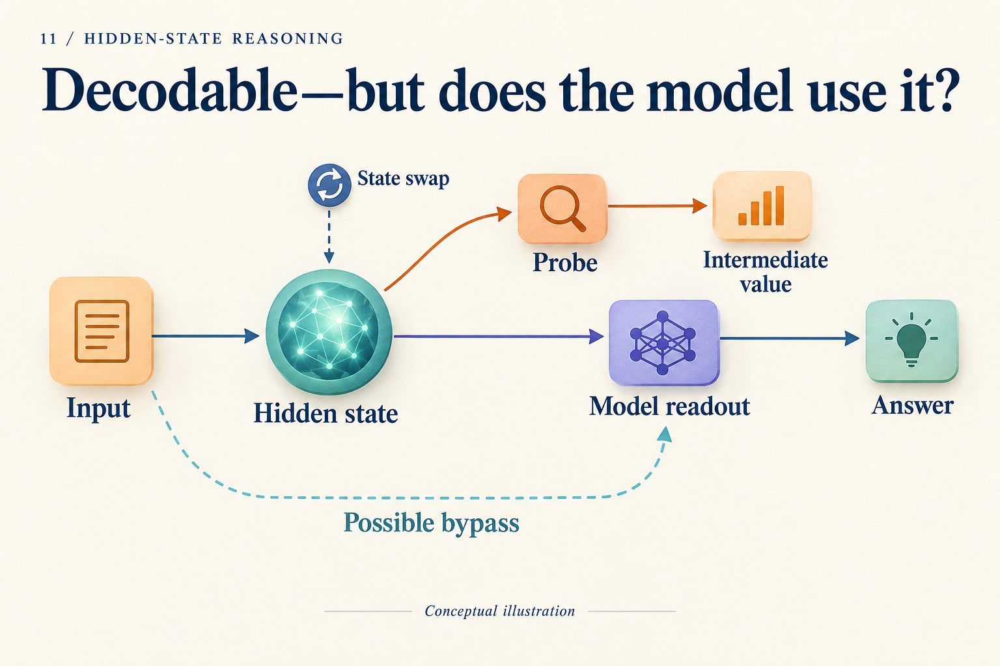

# You Decoded 36 from a Hidden State. What Comes Next?

## Post copy

Decoding 36 does not establish that the model used it. Transplant a candidate state for 40, retain subtraction of 4, and predict 36. This unrun teaching intervention explains counterfactual continuation and matched controls.

## Attachment and alt text

Image: `assets/11/cover.en.png`

Alt text: A hidden state branches to a probe and to the model answer, while input has a bypass; a state-swap marker distinguishes reading information from changing computation.

