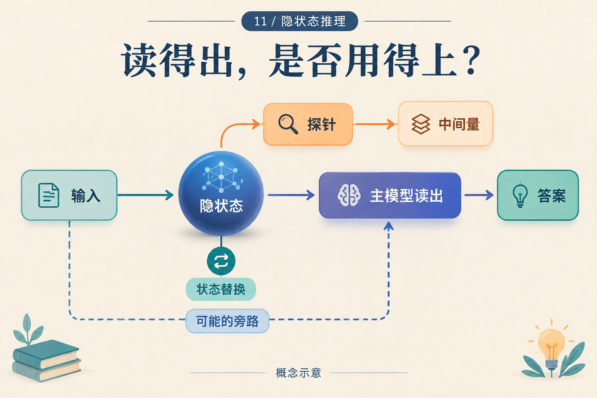

# 隐状态里读出了36，然后呢？

## Post copy

从隐状态读出36，还不知道模型是否用了它。若换入另一道题的中间量40，保留“减4”，它会得到36吗？这个未运行的教学干预，用不同于双方原答案的反事实和匹配对照追查因果作用。

## Attachment and alt text

Image: `assets/11/cover.zh.png`

Alt text: 隐状态分别连向探针和主模型答案，输入还有直接旁路；状态替换标记区分读出信息与改变计算。

