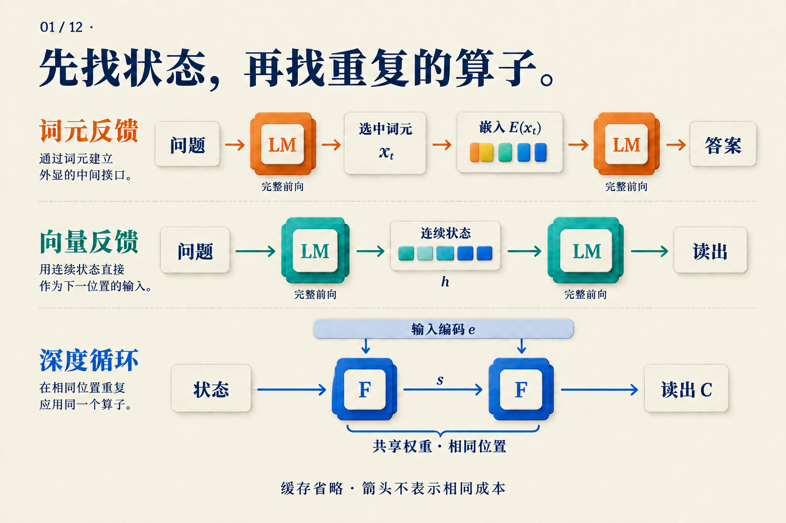
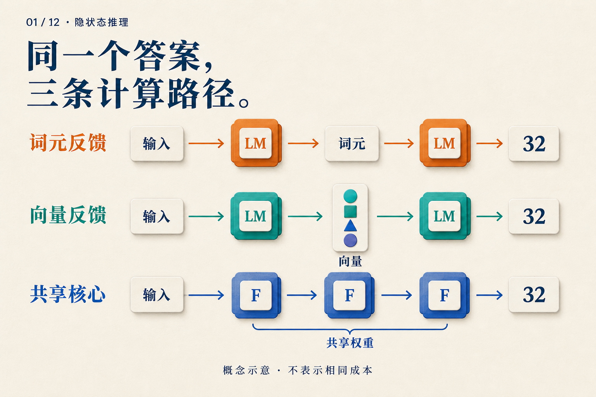

# 看到答案前，模型还做了什么？

仓库有三箱零件，每箱十二个，总共四个不能用，还剩多少个？

你看到两个回答：一个写出 `3 × 12 = 36，36 − 4 = 32`，另一个只写 `32`。很容易觉得，前者一步步算过，后者直接猜中了。但如果第二个模型在输出前更新了几十轮内部状态呢？只看聊天窗口，我们分不出来。

下面用这道**教学题**追踪三种计算路径。它们是假设的运行方式，不是三个模型的实测输出。我们要找的是：**当模型还没给答案时，下一步究竟拿什么继续算？**

## 先把“36”送回模型

从最熟悉的文字推理开始。模型生成 `3 × 12 = 36` 后，这段文字成为上下文的一部分。接下来生成减法时，它可以读取前面的 `36`。

不过，模型不会把纸面上的数字直接塞进下一层。一次普通生成大致经过以下接口：

```text
已有上下文 → 模型前向 → 选出词元
                         ↓
下一次模型前向 ← 该词元的嵌入向量
```

“词元”是 tokenizer 切分文本后的单位；`36` 可能占一个或多个词元。输出头先把末端隐状态变成词表分数，生成规则选出词元，再由嵌入表把它转换成下一位置的输入。每选出一个新词元，下一步的上下文就增长一点。

所以，写出中间步骤有一个计算上的作用：**本轮产生的结果，可以经由文字接口进入后面的计算。** 原始 CoT 工作通过在提示里提供带步骤的示例，使足够大的语言模型在多种推理任务上获益；这里改变的是提示，没有为每道任务重新训练一个模型。[CoT v6，§2–3](https://arxiv.org/abs/2201.11903v6)

这也解释了一个区别：把推理过程从界面隐藏，只改变我们看到什么；如果后台仍逐词生成，模型依然经过上面这条路径。Quiet-STaR 中辅助预测的内部理由就由离散词元组成。[Quiet-STaR v2，§4](https://arxiv.org/abs/2403.09629v2)

## 如果不必先选一个词呢？

普通模型在选词之前，已经有了一个向量。能否把它直接用作下一步输入？

Coconut 的连续阶段采用这种反馈。对零件题，可以把运行记录示意为：

```text
处理问题 → 得到向量 h[0]
输入 h[0] → 再运行模型 → 得到 h[1]
输入 h[1] → 再运行模型 → 得到 h[2]
结束连续阶段 → 恢复语言输出
```

这里省略了边界词元，轮数也是示意。真正改变的地方，是两个模型前向之间的输入接口：传回一个连续向量，替代“选词元再查嵌入表”。它仍然新增序列位置，仍然要等待前一个状态产生。历史位置的 KV 缓存也可以继续被读取。[Coconut v2，§3](https://arxiv.org/abs/2412.06769v2)

现在能把 `h[1]` 标成“36”吗？还不能。我们知道这个向量怎样产生，却没有测量它包含什么，更没有证明下一步如何使用它。图上的箭头能告诉我们信息有路可走；它不能替我们发现模型学到的算法。第04篇会展开这条路径的训练方法。

## 还可以留在原来的位置，多经过几次同一个模块

前两条路径都沿序列向后推进。深度循环改动的是另一个地方：在读出下一个词元前，让同一个内部模块重复更新状态。

把模型暂时拆成三个部件：`P` 先编码输入，`F` 更新状态，`C` 最后读出。一次假设的三轮运行是：

```text
e  = P(问题)
s1 = F(e, s0)
s2 = F(e, s1)
s3 = F(e, s2)
下一个词元的分数 = C(s3)
```

读这段代码时，先看没有变化的 `e`：每轮都能访问输入编码。再看 `s0 → s1 → s2 → s3`：变化的是运行状态。三次 `F` 使用同一套权重，但接收不同的状态，所以输出不必相同。这对应 recurrent-depth 论文中 prelude、共享 core 与 coda 的宏观设计；论文还规定了初始状态等细节。这里用 `F` 统一表示核心，三轮仅用于讲解。[Recurrent depth v1，§3.1、图2](https://arxiv.org/abs/2502.05171v1)

这一过程不必为每轮新增一个中间词元位置。状态可以覆盖现有的多个位置。同样，它也没有规定第一轮一定乘法、第二轮一定减法；那是人写的解题步骤，还不是对模型的观察。



*先沿上两行找“下一位置的输入”，再沿第三行找“不变的输入编码”和“更新的状态”。图省略历史缓存；一个 LM 方块与一个 F 方块不是等量计算。*

## 三条路径，留下三种不同的运行记录

假如我们可以打开系统日志，零件题的答案仍是 `32`，但日志可能出现这些区别：

| 路径 | 中间新增什么 | 下一次重复什么 |
|---|---|---|
| 文字反馈 | 选出的词元及其位置 | 新位置的模型前向 |
| 连续反馈 | 由前向产生的向量及其位置 | 新位置的模型前向 |
| 深度循环 | 现有位置的新状态 | 共享核心 |

这张表只比较刚才的三种设计。它不是把所有方法分成互斥类别：循环模型也可以生成文字链，一个系统也可以在不同阶段组合接口。



*现在再看这幅总览，三个“32”只表示输出可以相同。箭头数量没有给出延迟、FLOPs 或准确率排名。*

还有一种值得单独放进日志的情况：模型经过专门训练后直接回答，既没有中间文字，也没有新增的反馈循环。逐步内化工作从训练目标中逐渐删除思维链前缀，最终学习直接预测答案。它改变了参数怎样学到任务，训练规则本身没有给测试程序增加一个可延长的循环。[逐步内化 v1，§3](https://arxiv.org/abs/2405.14838v1)

因此，“没有写步骤”还可能来自学习方法的改变。要比较系统，训练时得到哪些帮助和测试时执行哪些运算，都得记录。

## 下一次，先问系统日志里的问题

对于这道零件题，我们希望知道三件事：中间信息留在哪里；哪个模块再次运行；重复多少次由谁决定。它们分别对应状态、运算和预算。

回答这些问题后，才轮到效果判断。多运行几轮是否提高准确率，要在固定任务上测；是否更快，要计入每轮前向、缓存与最终输出的实际延迟。共享权重可以减少不同参数的存储，却不会让三次执行变成一次。

最后，可读过程也不能取代这种核查。CoT 原文把文字链视为理解行为的一扇窗口，同时指出它尚不能完整刻画支撑答案的神经计算。[CoT v6，§2、§6](https://arxiv.org/abs/2201.11903v6)

聊天窗口里的 `32` 是调查的起点。沿着它往回找输入、状态和重复执行的模块，我们才开始看见答案之前发生了什么。
