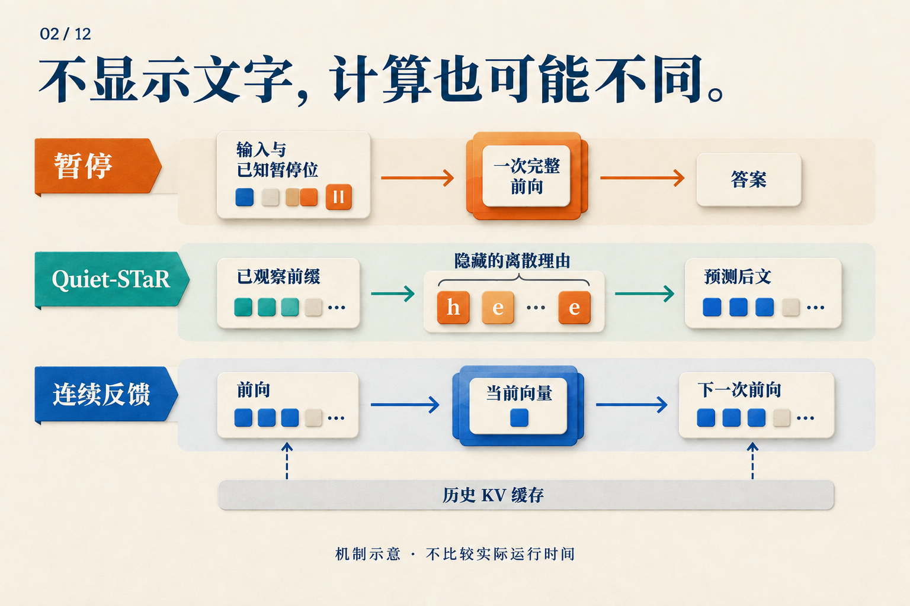

# 三个暂停词元，为什么不等于三步思维链？

已知 `A ⊆ B`、`B ⊆ C`，问 `A ⊆ C` 是否成立。答案是成立：A 中的元素先属于 B，也就属于 C。

如果让语言模型回答，我们可以在问题后加三个预先选好的暂停词元，也可以让它先生成三个中间词元。两种做法都多出三个位置。**模型会因此多做同样的计算吗？**

下面用一个两层 Transformer 跟踪这道教学题。两层、三个位置都只是为了看清依赖关系；没有假设它真的学会了子集推理，也没有把某个暂停位置指定为一条逻辑规则。

## 暂停词元先占位置，表示随后才算出来

把三个暂停位置叫作 `p1、p2、p3`。它们使用同一个特殊词元，进入模型前就已知：

```text
问题 | p1 | p2 | p3
```

已知的是输入，不是内部表示。初始时，模型拿到词元嵌入和位置相关信息；第一层把这些输入变成第一层表示，第二层再处理第一层表示。

在这个采用因果注意力的示意模型中，可以沿着最后一个暂停位置看：

| 计算阶段 | p3 可以读取什么 |
|---|---|
| 输入准备 | 已知的暂停嵌入与位置信息 |
| 第一层注意力 | 问题、p1、p2、p3 的层输入 |
| 第二层注意力 | 这些位置的第一层表示 |
| 输出读出 | 用 p3 的末层表示预测答案首词元 |

第一层计算 `p3` 时，不必等待 `p2` 的第一层输出，因为它读取的是**同一层的输入**。整个输入序列已知，各位置就可以在每层中批量计算；因果掩码规定可读取的位置，不要求它们从左到右逐个执行。

到了第二层，`p3` 可以读取 `p1、p2` 经过第一层加工后的表示。新增位置因此提供了额外的中间表示与计算路径。但它们仍处在这个两层网络中，没有把网络变成先完整跑两层、再完整跑两层的三轮反馈。

Pause-training 论文从增加计算位置的角度提出这种设计，并在讨论中区分了宽度与串行深度。上表是因果掩码下的讲解；实际任务的掩码设置仍须按论文读取。[Pause-training v1，§2–3、§6](https://arxiv.org/abs/2310.02226v1)


*左边的“单次”不等于免费：更多位置要执行更多运算。它表示这些输入可以一起送入模型。右边的后续输入尚未产生，必须等待。图左采用一般位置示意；本文的三个暂停都接在问题后。*

## 让模型自己生成，等待就出现在另一处

现在把预先给定的暂停，换成模型生成的中间词元 `u1、u2、u3`。模型在第一次前向前不知道 `u1` 会是什么，更不知道后面的两个。

要得到答案首词元，依赖链变成：

```text
处理问题             → 选 u1
处理新增的 u1        → 选 u2
处理新增的 u2        → 选 u3
处理新增的 u3        → 选答案首词元
```

每行的新位置都要经过模型各层。KV 缓存可以省去对历史位置的重复计算，却不能提前知道尚未选出的输入。这里比较的是答案首词元之前的路径；答案本身若有多个词元，两种方案都还要继续生成。

对我们的子集题，文字链可以写明“任取 a ∈ A，得到 a ∈ B，再得到 a ∈ C”。那会把可读的中间结论带入后续上下文。暂停位置没有这段预先标注的内容，模型需要学会怎样用它们。

因此，三个暂停位置和三个生成词元的数量虽然相同，串行依赖并不相同。不能把这个差别直接换算成三倍加速：每轮工作的大小、缓存和硬件调度仍然影响延迟。

## 有了位置，什么会推动模型使用它？

在训练时，我们可以要求模型在暂停后预测正确答案。预测误差会沿计算图反传，更新暂停嵌入和模型参数；只要暂停位置影响了答案，它们就在这条学习路径上。无需给 `p1` 标注“A 属于 B”，也可以有训练信号。

实际 Pause-training 使用专门的可学习词元。预训练时在文本中随机插入它，不把“预测暂停词元”作为损失目标；下游微调则在输入后加固定数量的暂停，再监督目标文本。论文所研究的效果来自这样的训练，而不是随手在聊天提示中添几个句号。[Pause-training v1，§3.1](https://arxiv.org/abs/2310.02226v1)

一个有用的实验比较是：模型只在微调时见到暂停，和在预训练、微调中都见到暂停，会怎样？论文在 130M、1B 模型上比较了这些组合。两个阶段都使用暂停时，多数任务改善；只在微调时引入，结果更混合。这支持“新增位置需要学会使用”，并未揭示每个位置具体执行了什么算法。[Pause-training v1，§4.3](https://arxiv.org/abs/2310.02226v1)

回到三个暂停的示意：不能因为三个有用，就断言三十个更好。论文的暂停数量消融也没有呈现持续增长的收益。测试时改变数量，还会改变模型熟悉的输入分布。[Pause-training v1，§5](https://arxiv.org/abs/2310.02226v1)

## 训练数据已经写好的链，是另一个容易混淆的情况

刚才逐词等待的，是**运行时生成**。如果训练数据已经给出正确链 `u1、u2、u3`，我们就能一次准备好它们：

| 预测目标 | teacher forcing 提供的前缀 |
|---|---|
| u1 | 问题 |
| u2 | 问题 + 正确 u1 |
| u3 | 问题 + 正确 u1、u2 |
| 答案 | 问题 + 正确 u1、u2、u3 |

因果掩码让模型在一次训练前向中学习这些目标，每个目标只能看到自己的前缀。训练在这里使用正确历史，不必先采样出它。所以，同一段文字可以批量训练，生成时却仍逐词等待。

连续反馈又不同：下一位置的输入来自上一次计算，没有一列正确词元可以事先填进去。Coconut 因而在训练中也要逐步产生连续状态，再计算后续文字损失。[Coconut v2，§3，Training Details](https://arxiv.org/abs/2412.06769v2)

## 不展示的理由，应该放在哪一边？

看它的输入怎样产生。Quiet-STaR 在文本前缀后生成离散的辅助理由，把有理由和无理由的后续预测混合，并用理由对后文预测的帮助提供学习信号。多个前缀的候选可以并行组织，但一条候选内部仍逐词推进，各分支不能任意互读。[Quiet-STaR v2，§4.1–4.4](https://arxiv.org/abs/2403.09629v2)

因此，理由是否展示与它是否需要等待是两回事。预测后文的奖励也不能直接解释成“逻辑推导正确”的判分。



*按“输入事先给定，还是由上一步产生”阅读这三行。连续反馈里的当前向量与历史缓存分开画，因为下一步能访问的不只有一个向量。*

原始 CoT 论文也通过只给方程、加入无语义输出、把解释放在答案后等消融，考察中间文字的作用。那些提示实验说明需要拆开因素研究，不能代替这里各方法自己的训练实验。[CoT v6，§3.3](https://arxiv.org/abs/2201.11903v6)

三个暂停到底有没有帮助，最后仍要由任务表现回答。理解它之前，只需先把“多想三步”改写得更准确：新增了三个已知位置，还是三次由输出决定输入的推进？这个区别会直接改变训练方式，也会改变我们怎样计算成本。
