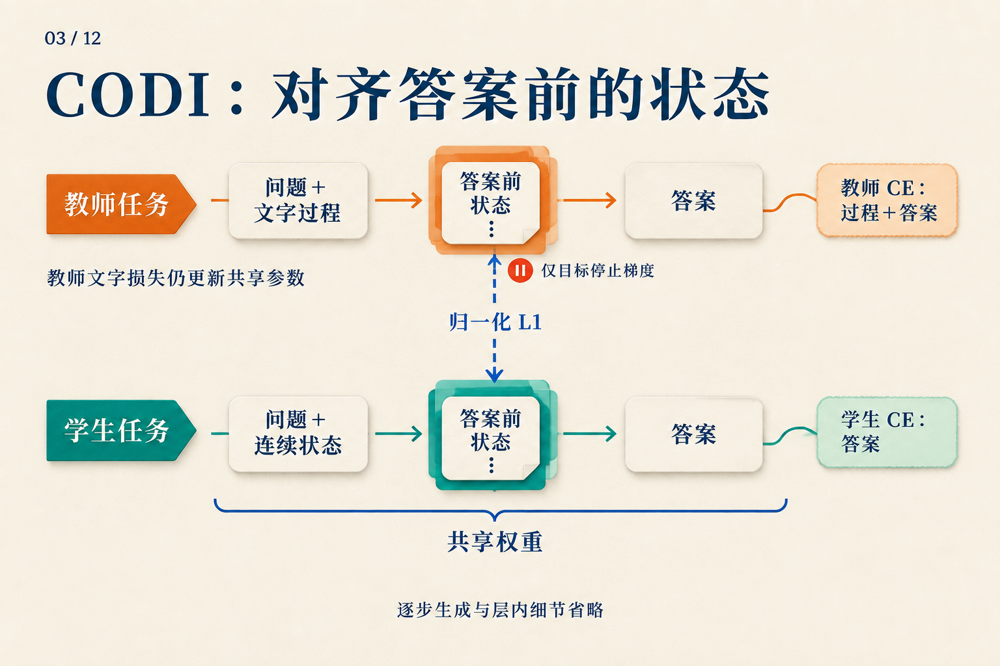
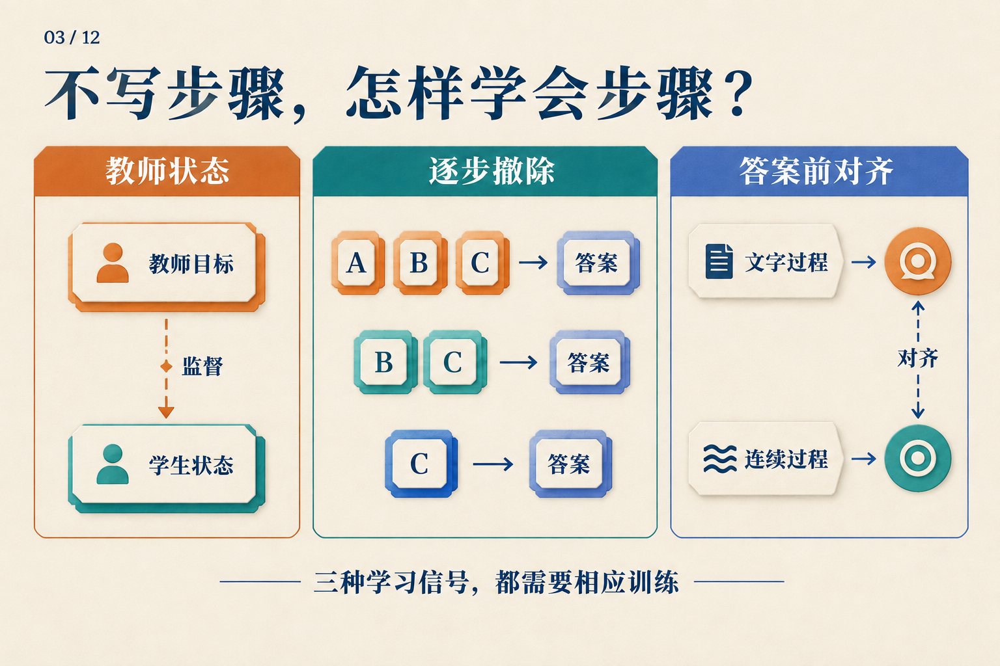

# 删掉中间步骤以后，训练误差还从哪里来？

四袋弹珠，每袋六颗。取走八颗后，把剩下的平均分给两个人，每人得到多少颗？

用这道**教学题**，我们可以写出一条训练示例：

```text
A：4 × 6 = 24
B：24 − 8 = 16
C：16 ÷ 2 = 8
答案：8
```

A、B、C 是我们给文字步骤起的名字，不代表单个词元或三个已知的隐状态。现在想训练一个最终只回答 `8` 的模型。删掉 A、B、C 很容易，难的是让它在失去这些文字以后仍然做对。

关键在于：**删掉文字时，哪些预测目标消失了，哪些误差信号还能回到模型里？**

## 先看一个答案损失能说什么

为方便手算，假设答案 `8` 恰好是一个词元。如果模型给正确答案的概率是 0.25，它的交叉熵损失就是 `−ln(0.25) ≈ 1.386`；提高到 0.5 后，损失降为 `−ln(0.5) ≈ 0.693`。

这些数是教学计算，不是模型的实测预测。它说明答案监督在奖励什么：提高正确词元的概率。损失可以通过链式法则更新前面的参数，所以只有答案监督也能学习。

但这个损失没有单独要求模型先得到 `24`，再得到 `16`。一条完整文字链则提供更多预测目标：模型既要在问题后预测 A，也要在读到正确 A 后预测 B，依此类推。Teacher forcing 在训练中提供这些正确前缀；模型生成时，前缀才来自自己的输出。

于是，删除步骤改变了两件事：后面能读取的文字少了，需要预测的文字目标也少了。下面几种训练方法，分别从不同地方弥补这个变化。

## 先少删一点，让下一个目标接住训练

不要一下把链删光。先用完整链训练，再逐渐删去开头，直到只剩答案。

| 课程中的时刻 | 保留的目标顺序 | 最先要解决的预测 |
|---|---|---|
| 完整链 | A → B → C → 答案 | 从问题预测 A |
| 删除 A 后 | B → C → 答案 | 从问题预测 B |
| 删除 A、B 后 | C → 答案 | 从问题预测 C |
| 全部删除后 | 答案 | 从问题直接预测 8 |

*这是按完整步骤显示的几个课程时刻。逐步内化论文实际从前缀逐词元删除，中间还会经过表中没有画出的阶段。问题始终保留；删掉的步骤不会作为空白占位留在输入中。*

看第二行。模型仍然要预测 `24 − 8 = 16`，但不再先读到 `4 × 6 = 24`。这个剩余目标把新的学习任务变得很具体：用题目本身补偿丢失的文字前缀。等模型适应后，再继续撤掉一部分。

逐步内化工作采用这种训练课程，并用优化器状态重置和删除数的随机偏移处理过渡中的不稳定。它没有要求某个隐藏向量逐字还原 A；课程最后得到的是直接回答模型，也没有仅凭删除操作新增测试时的循环。[逐步内化 v1，§3](https://arxiv.org/abs/2405.14838v1)

课程是否成功仍要测。论文在乘法任务上取得很强的结果，但 GSM8K 的显式 CoT 基线仍更强；更难乘法中的不同课程检查点还呈现准确率与速度的折中。因此，表中最后一行是训练目标，不是成功保证。[逐步内化 v1，§5–6、表2–3](https://arxiv.org/abs/2405.14838v1)

## 如果保留一些内部计算位置，损失会怎样经过它们？

现在考虑另一种运行方式：文字 A 被删掉，但答案前有模型自己产生的连续状态 `h1、h2`。这些位置没有可以直接填入的“正确文字”。

```text
问题 → h1 → h2 → 预测保留的文字与答案
                  ↑
           在这些预测上计算损失
```

若 `h2` 影响答案概率，答案损失就能更新产生 `h2` 的参数；若 `h2` 依赖 `h1`，梯度还可以继续经过 `h1`。**一个位置没有自己的词元预测目标，不等于它收不到梯度。**

Coconut 把连续反馈与课程结合，在剩余文字和答案上计算损失，屏蔽问题和连续位置的词元损失。第04篇会走完其运行过程；这里要抓住的是损失位置：连续状态因有助于后续预测而学习，并没有逐句重建被删除文本的要求。[Coconut v2，§3、图2](https://arxiv.org/abs/2412.06769v2)

这给了训练一条路径，却仍留下选择：仅靠最终预测，把内部表示塑造成有用的样子，是否足够容易？如果教师已经做过完整推理，能否再给学生一个状态目标？

## 教师状态可以提供目标，但测试时谁来产生它？

早期隐式 CoT 蒸馏把这件事拆成三个阶段：让学生先学会利用教师状态回答，再让一个 emulator 从问题预测所需状态，最后把预测器与学生接起来联合优化。教师提供的是选定层、选定词元位置的表示，并非整条轨迹的所有激活。[隐式 CoT 蒸馏 v1，§3.1–3.3](https://arxiv.org/abs/2311.01460v1)

套到弹珠题上，训练时可以先运行带 A、B、C 的教师，取得被选中的表示，学习“如何利用这些表示回答”。但到了测试时，我们只有问题，不能把正确 A、B、C 偷塞回去。因此，第二阶段的状态预测器是必需的，测试成本也要包括它。

这个分工还暴露了一个困难：同一道题可以有不同的正确文字过程。例如，先算每人分得 `24 ÷ 2 = 12`，再扣除每人对应的 `8 ÷ 2 = 4`，同样得到 `8`。教师走不同过程时，状态目标可能不同。论文为多路径问题引入混合表示及相应的中间词元监督，避免简单均值拟合抹平不同模式。[隐式 CoT 蒸馏 v1，§3.2](https://arxiv.org/abs/2311.01460v1)

状态监督因此不是一个无须设计的标准答案：要选择对齐什么、怎样处理多个目标，以及测试时怎样产生替代状态。

## 把监督放在准备回答的那个位置

CODI 选择了更集中的对齐位置：答案提示 `The answer is:` 中的冒号。在共享同一模型权重的两项训练任务中，教师看到文字过程，学生执行连续计算，再对齐这个位置各层的激活。[CODI v2，§3.1–3.4](https://arxiv.org/abs/2502.21074v2)

为什么这位置值得看？对弹珠题来说，它处在“可以读到前面的计算”和“即将预测答案”的交界处。对齐这里，给学生增加一个与回答相关的内部目标，无需规定每个连续位置分别代表 `24`、`16` 或 `8`。

先把三种损失分开读：

| 损失 | 比较什么 |
|---|---|
| 教师文字损失 | 教师对文字过程与答案的预测，和正确词元 |
| 学生答案损失 | 学生连续计算后的答案预测，和正确词元 |
| 状态蒸馏损失 | 答案前位置的学生激活，和教师激活 |

总目标是把它们按权重相加：

`L = α Lteacher + β Lstudent + γ LKD`

前两项就是前面解释过的词元预测损失。第三项使用 L1 距离：逐坐标看学生与教师相差多少，并按教师激活尺度做规范化。举一个**纯示意**：若已规范化的两个教师坐标是 `[2, −1]`，学生是 `[1, −0.5]`，对应绝对差为 `[1, 0.5]`。真实计算会汇总所选位置各层的激活；这里的两个坐标不对应弹珠数量。[CODI v2，§3.4–3.5](https://arxiv.org/abs/2502.21074v2)



*沿两条横线找文字损失，再沿虚线找状态损失。停止梯度只施加在虚线的教师目标一侧：教师仍通过自己的文字损失更新共享权重。*

如果状态损失也把教师目标一起拉向学生，两边可以相互迁就。CODI 在这条边上停止教师梯度，让学生朝当前教师目标靠近；教师任务仍有自己的训练信号。把整位教师画成永久冻结，会误读这套共享权重设计。

还有一个数据细节。在我们的示例中，C 已经把答案 `8` 写了出来。教师若读到它，答案前状态可能只需记住答案。CODI 因而删除训练轨迹中最后直接给答案的步骤，并报告保留该步骤会降低其消融设置的表现。这是减少捷径的处理，不是证明其余状态都编码了完整算法。[CODI v2，§3.5、§4.4、表2](https://arxiv.org/abs/2502.21074v2)

## 回到那张被删短的训练示例

同一条 `A → B → C → 答案`，现在有三种不同的帮助方式：逐步减少必须依赖的文字，提供教师状态目标，或在答案前对齐表示。



*中间的 A、B、C 可以对应本文的三个文字步骤；图是监督方式总览，不表示每删一个步骤就把它存进一个向量。*

这些方法能让直接或连续回答变得更有用，但不能从损失形式推出它们普遍等价于显式 CoT。CODI 的分布外数学评测就是一个具体提醒：其 GPT-2 设置超过表中的显式基线，而 LLaMA-1B 设置在同三项上仍落后于显式 CoT。[CODI v2，§4.3、表1](https://arxiv.org/abs/2502.21074v2)

看下一种隐式推理训练方法时，可以先拿一条样本，标出它保留哪些目标，误差落在哪些位置，测试时还需谁来产生状态。这比只问“有没有思维链监督”更具体，也更接近模型真正收到的学习任务。
