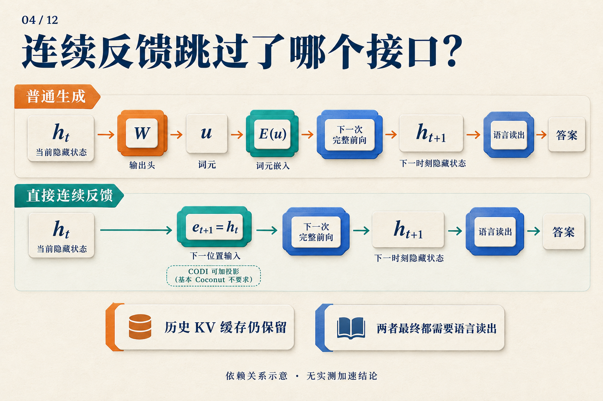

# 不写中间步骤，模型怎样继续算？

三箱零件，每箱十二个，其中四个损坏，还剩多少个？

我们可以先写 `3 × 12 = 36`，再写 `36 − 4 = 32`。对自回归语言模型来说，写下这些中间步骤还有一个作用：它们进入上下文，成为后续计算可以读取的输入。

于是出现了一个值得追问的问题：**模型已经产生了内部表示，为什么一定要先把它变成词元，才能继续？**

Coconut 尝试改变这个接口：在一段计算中，把当前隐状态直接交给下一个位置。下面就沿着这道零件题，走一遍它怎样运行、怎样训练，以及实验中得到了什么。零件题是教学示例；文中的性能数字来自论文。

## 写下来的结果，怎样回到模型里？

先看普通生成。模型读完已有上下文，得到末端隐状态 `h[t]`。输出头把它映射成词表上的分数，生成规则选出一个词元 `u`；下一步再查嵌入表，把 `u` 变成向量 `E(u)`，送回模型。

```text
当前隐状态 → 输出头 → 选词元 → 查嵌入表 → 下一次前向
```

零件题中的“36”就是这样逐词元写进上下文的；实际切成几个词元取决于 tokenizer。生成后面的减法时，模型可以通过注意力读取前面的文字及其表示。

这里有两份要分开的东西：**新位置的输入**，以及**它可以读取的历史**。前者来自刚选出的词元，后者包括问题和已经写下的过程。这个区分很快会派上用场。

## 把隐状态直接交给下一位置

在 Coconut 的连续阶段，模型不再先选词、再查嵌入表，而是直接使用：

`e[t+1] = h[t]`

左边是下一位置的输入，右边是当前位置的末层隐状态。读这条式子时，可以把注意力放在那个等号上：**这次计算的输出向量，直接成为下一次计算的输入向量。** [Coconut v2，§3](https://arxiv.org/abs/2412.06769v2)



*沿上排找到 h[t] 与下一次前向之间的接口，再看下排怎样替换它。图中 CODI 的投影属于另一种设计；基本 Coconut 使用直接反馈。语言读出表示连续阶段结束后的输出路径，图中省略了阶段边界词元。* [CODI v2，§3.3](https://arxiv.org/abs/2502.21074v2)

具体走两步会更清楚。Coconut 用 `<bot>` 和 `<eot>` 标记连续区间的开始和结束：

1. 先处理问题和 `<bot>`，取 `<bot>` 位置的末层隐状态，记为 `h[0]`。
2. 把 `h[0]` 放到第一个连续位置作为输入，执行一次前向，得到 `h[1]`。
3. 把 `h[1]` 放到第二个连续位置，再执行一次前向，得到 `h[2]`。
4. 连续阶段结束，接入 `<eot>`，恢复正常的词元输入和语言输出。

每一步仍能访问已有历史。工程上，KV 缓存保存已经处理位置的键和值，避免重算它们；新位置的前向仍然要执行。理解 Coconut 时，更完整的状态图景是“当前输入向量，加上可访问的历史”。[Coconut v2，§3](https://arxiv.org/abs/2412.06769v2)

回到零件题，我们知道 `h[0]`、`h[1]`、`h[2]` 是怎样产生的，却还不知道其中是否有一个明确表示了“36”。计算接口告诉我们数据怎样流动。要让这条路径有用，模型还得学会往里面放什么信息。

## 模型怎样学会不用文字支撑下一步？

Coconut 从有文字推理步骤的数据开始训练，再逐步移除前面的步骤，用连续位置接替。下面取“每删一个推理步骤，增加一个连续位置”，也就是 `c = 1`，展示零件题的课程变化：

| 阶段 | 连续位置数 | 保留的文字推理 | 最终答案 |
|---|---:|---|---|
| 0 | 0 | `3 × 12 = 36`；`36 − 4 = 32` | `32` |
| 1 | 1 | `36 − 4 = 32` | `32` |
| 2 | 2 | 无 | `32` |

*问题始终保留。表中省略边界词元；连续位置里的向量由模型运行产生，没有预先填写“36”或“32”。这是课程规则的教学示意。*

在阶段 1，模型要预测剩下的减法过程，但输入中已经没有写好的第一步。训练误差从剩余文字和答案一路反传，经过连续反馈，推动模型学会利用这个新接口。到阶段 2，文字推理也移除了，答案仍提供监督。

这解释了一个容易误读的地方：训练安排让一个连续位置接替了一句文字，**损失函数却没有要求这个向量逐字还原那句话**。它学到怎样的表示，要由后续任务和优化共同决定。

实际论文中，第 `k` 阶段用 `k × c` 个连续位置替换前 `k` 个推理步骤。GSM8K 设置采用 `c = 2`，连续位置数先从 0 增至 2、4、6，后续阶段保持 6 个并移除剩余文字步骤。上面的两步示例解释的是课程规则，并非论文完整训练配方。[Coconut v2，§3、§4.2](https://arxiv.org/abs/2412.06769v2)

运行路径和训练信号现在接上了：连续反馈提供继续计算的地方，课程则教模型在文字支架逐渐减少时使用它。接下来要看，这样学出来的模型能答对多少题。

## 它学会了多少？先看数学题，再看逻辑题

论文用 GPT-2 比较了几种训练方式。下面选取表 1 中的三行；数值为准确率百分比，`±` 按原表保留。

| 方法 | GSM8K 数学题 | ProntoQA 逻辑题 | ProsQA 逻辑题 |
|---|---:|---:|---:|
| 直接回答（No-CoT） | 16.5 ± 0.5 | 93.8 ± 0.7 | 76.7 ± 1.0 |
| 显式思维链（CoT） | 42.9 ± 0.2 | 98.8 ± 0.8 | 77.5 ± 1.9 |
| Coconut | 34.1 ± 1.5 | 99.8 ± 0.2 | 97.0 ± 0.3 |

*来源：Coconut v2，表 1。实验使用贪心解码，并在验证集上选择 checkpoint；这些数字对应论文的模型、数据与训练设置。* [原文 §4、表1](https://arxiv.org/abs/2412.06769v2)

先看 GSM8K：34.1 高于直接回答的 16.5，却仍低于写出思维链的 42.9。对于零件题这样的数学推理动机，这组结果呈现了一个具体取舍：连续计算可以学到有用的东西，但这里还没有保住显式链的全部准确率。

再看 ProsQA，Coconut 明显超过表中的显式 CoT。不过，只看这三行还不能把收益全部归给连续反馈。原表另有逐步移除文字、最终直接回答的 iCoT，它在 ProsQA 达到 **98.2 ± 0.3**，也高于 Coconut。课程本身就是需要单独考察的因素。[Coconut v2，表1、§4.3](https://arxiv.org/abs/2412.06769v2)

“少写了步骤”和“更快”也需要分开测量。刚才的两步演示中，得到 `h[1]` 后才能产生第二个连续输入，这个等待仍然存在。论文主实验通常使用预设的连续步数；增加这些位置，也没有持续改善表现。想知道一套实现是否值得采用，最终还得把答案质量和实测延迟放在一起比较。[Coconut v2，§3、§4.4、附录C](https://arxiv.org/abs/2412.06769v2)

## 不选一个词，会不会保留更多可能的路径？

连续表示很容易让人想到一种可能：模型也许不必立刻选定一条文字路径，可以先保留多个候选，算几步以后再作决定。论文在合成逻辑任务上专门研究了这个问题。

研究者使用混合不同训练阶段的变体，使模型能在不同连续位置切回文字，然后比较它对候选概念的读出概率。他们观察到多个候选获得较高概率，后续分布逐渐集中到更有希望的路径。这为“搜索式计算”的解释提供了证据。[Coconut v2，§5](https://arxiv.org/abs/2412.06769v2)

这里读出的是候选概率，并没有完整解码隐状态中的搜索树，也没有证明模型执行标准广度优先搜索。这组分析使用的还是专门训练的变体。因而，我们可以用它提出机制假说，但不能据此给零件题中的每个向量指定一条已知推理步骤。

## 把它放回连续推理的地图

到这里，Coconut 的核心可以用一条路径描述：**上一步末层隐状态 → 下一位置输入 → 又一次模型前向。** “连续”指两步之间传递的表示；“继续算”来自仍然执行的前向过程。

其他研究也使用连续向量，但交给它们的工作不同。下面这张图适合在理解 Coconut 后再看：


*第一行是本文展开的连续反馈。后两行用于定位相邻路线，不表示它们具有相同的计算成本。*

CCoT 研究怎样从问题预测少量压缩后的教师轨迹状态，再供答案解码器使用；SoftCoT++ 用多种软提示引导后续显式推理。前者关注压缩状态的预测，后者增加推理的起点。它们可以留作下一步阅读，无须先把这些接口都记住，才能理解 Coconut。[CCoT v1，§3–4](https://arxiv.org/abs/2412.13171v1)；[SoftCoT++ v1，§3](https://arxiv.org/abs/2505.11484v1)

再看最初那道零件题：隐藏中间文字只是输出形式。Coconut 做出的具体改变，是让中间计算经由连续向量接到下一步，并通过训练让这条路径承担任务。它究竟保留了什么、比写草稿好在哪里，分别需要机制分析与实验回答。
