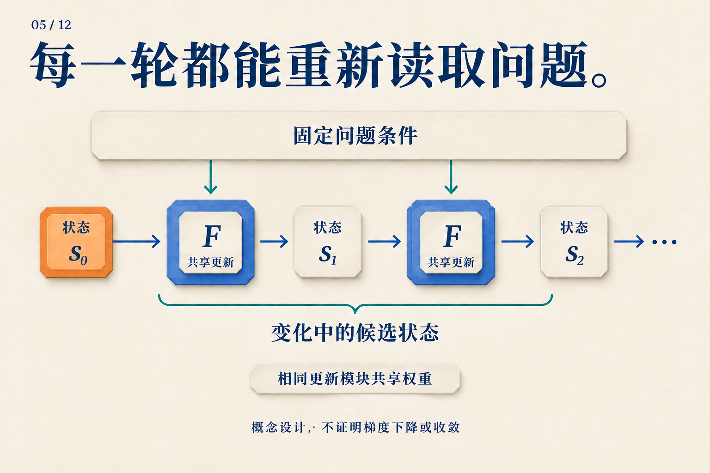
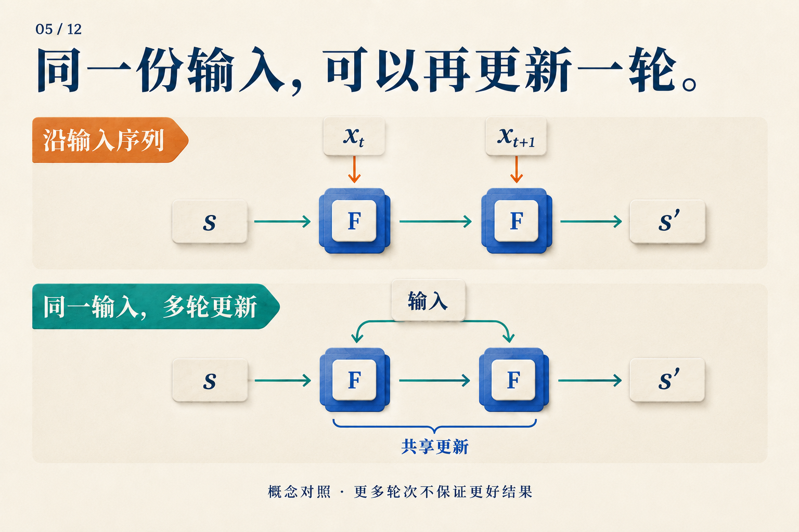

# 为什么同一个 Transformer 值得再跑一轮？

计算 `0111 + 0001`，也就是 `7 + 1`。从最右边开始，`1 + 1` 产生进位；进位碰到下一个 `1`，又要向左传。直到遇到最左边的 `0`，结果才成为 `1000`。

这道题可以说明循环计算为什么有用。但先约定：**下面是一套人为设计的并行进位算法，不是对某个 Transformer 内部活动的观测。** 我们知道这套规则每轮做什么，再用它追问神经网络需要学会什么。

## 先让进位每轮只走一格

把四个位看作四个位置，最右边编号为 0。每个位置保留两个输入位，以及来自右边的进位。更新规则很短：两个输入都是 1，就产生进位；恰好一个是 1，就把收到的进位继续传出去；两个都是 0，就不再进位。

现在让所有位置同时更新，而且只能读取**上一轮**的进位。这样，本轮刚产生的进位要等下一轮才能继续向左走。初始时把进位都设为 0，得到：

| 已完成的更新轮数 | 进入第 3、2、1 位的进位 | 用当前进位读出的四位结果 |
|---|---|---|
| 0 | `000` | `0110` |
| 1 | `001` | `0100` |
| 2 | `011` | `0000` |
| 3 | `111` | `1000` |
| 4 | `111` | `1000` |

*表中进位和结果均按高位到低位排列。第 0 位的输入进位始终为 0；本题没有四位以外的溢出。前几行是尚未完成的读出，不是新的算术答案。*

第一轮，最右侧发现 `1 + 1`，只来得及让第 1 位收到进位。第二轮，第 1 位把它传给第 2 位。第三轮，进位终于到达第 3 位。第四轮没有新信息需要传递，结果保持不变。

用符号写，就是对每个位 `i` 同时执行：

```text
下一轮进位[i+1] = (a[i] AND b[i])
                 OR ((a[i] XOR b[i]) AND 本轮进位[i])
结果位[i]       = a[i] XOR b[i] XOR 本轮进位[i]
```

有用之处在于：**规则没有变，变化的是规则接收到的状态。** 同一条小规则在后一轮获得新进位，就能继续推进计算。它不需要分别背下“第一轮算法”“第二轮算法”“第三轮算法”。

这是局部更新规则的例子。自注意力能够连接更远的位置，因而这张表不是 Transformer 必须运行三轮的下界。

## 把这个过程放到神经网络里

我们可以让一个共享模块反复更新状态：

`下一轮状态 = F(问题条件, 当前状态)`

在进位算法中，问题条件是两个原始二进制数，当前状态是各位已收到的进位。换成神经网络，状态会成为向量或矩阵；希望学到的是一种能在不同中间状态上继续工作的更新。



*把上方看成始终可读的两个加数，把横向路径看成逐渐传播的进位。这是帮助理解输入与状态分工的类比，图中没有声称网络执行该算法。*

这也解释了为什么有些循环设计每轮都重新提供问题。修改工作状态时，模型不必同时承担“把原始问题永久无损地记在状态里”的任务。

一个实际研究对象是根据上下文样本拟合函数。*Looped Transformers are Better at Learning Learning Algorithms* 从零状态开始，每轮重新加入输入，并在后段轮次施加损失。在线性回归的消融中，仅绑定权重而不重复注入输入的版本，在超过训练轮数后退化得更明显。这个对照支持该设置中的输入注入设计；它还没有识别网络内部究竟执行哪一种优化算法。[论文 v3，§4–4.1、图3](https://arxiv.org/abs/2311.12424v3)

## “再来一步”到底沿着哪条轴？

普通序列 RNN 也共享参数，但它通常在读到下一个输入时更新。刚才的进位过程则是在输入已经给定后，对同一个问题再计算一轮。



*上排换了输入位置，下排增加了内部轮次。图中的两步不代表相同工作量。*

因此，写一个状态时可以带两个下标：`s[t,r]`。`t` 回答“处理哪个输入位置”，`r` 回答“已经内部更新几轮”。当我们说循环深度，主要谈的是第二个坐标。

Universal Transformer 将共享的自注意力与变换模块沿内部轮次展开，更新同一组序列位置。它分别加入位置和轮次编码，让更新器知道“在哪里”和“到了哪一轮”。各位置的一轮更新可以并行，轮与轮之间依次连接。[Universal Transformers v3，§2.1](https://arxiv.org/abs/1807.03819v3)

至于每个输入应运行几轮，ACT 提供了一种学习办法：对同一输入继续更新，并累计停机值，最终以含剩余权重的系数混合状态和输出。Universal Transformer 的动态版本把这类机制用于各位置。停机的数值含义留到第 08 篇展开；这里先看到，**共享更新规则与选择执行次数，是两个可以分别设计的部分。** [ACT v6，§2](https://arxiv.org/abs/1603.08983v6)；[Universal Transformers v3，§2.2](https://arxiv.org/abs/1807.03819v3)

## 接成一个环，为什么还不够？

进位算法能继续工作，是因为每轮都维护了同一种含义：当前位置保存“到这里的进位”。而一个训练好的网络，也可能学成“第三轮才把答案整理给输出头”，第四轮又把表示改掉。共享权重并不排除状态中出现内部计数器。

如果目的只是减少独立参数组，这不一定是问题。Subformer 共享中间层、保留首尾独立层，并结合嵌入分解研究参数效率；这类设计的成功标准不等同于“任意多跑几轮也有用”。[Subformer v3，§2–3](https://arxiv.org/abs/2101.00234v3)

若希望像进位表那样，在完成后停留在稳定答案，则需要进一步约束更新。Deep Equilibrium Models 走得更远：直接用固定点方程定义输出状态，前向求根、反向使用隐式微分。它关注平衡点；有限轮循环还可以利用尚未到达平衡点的有用状态。[Deep Equilibrium Models v2，§3.1](https://arxiv.org/abs/1909.01377v2)

于是，对“再跑一轮有没有用”的检验也更具体了。对于学来的进位更新，可以固定输入位数，分别增加连续进位链的长度；再检查新增轮次是否把错误逐步修正，以及已正确的输出能否保持。这里提出的是待做的实验。前面的手工规则提供了一个清晰参照：值得重复的计算，应当能接住当前进展，把同一个问题继续做下去。
