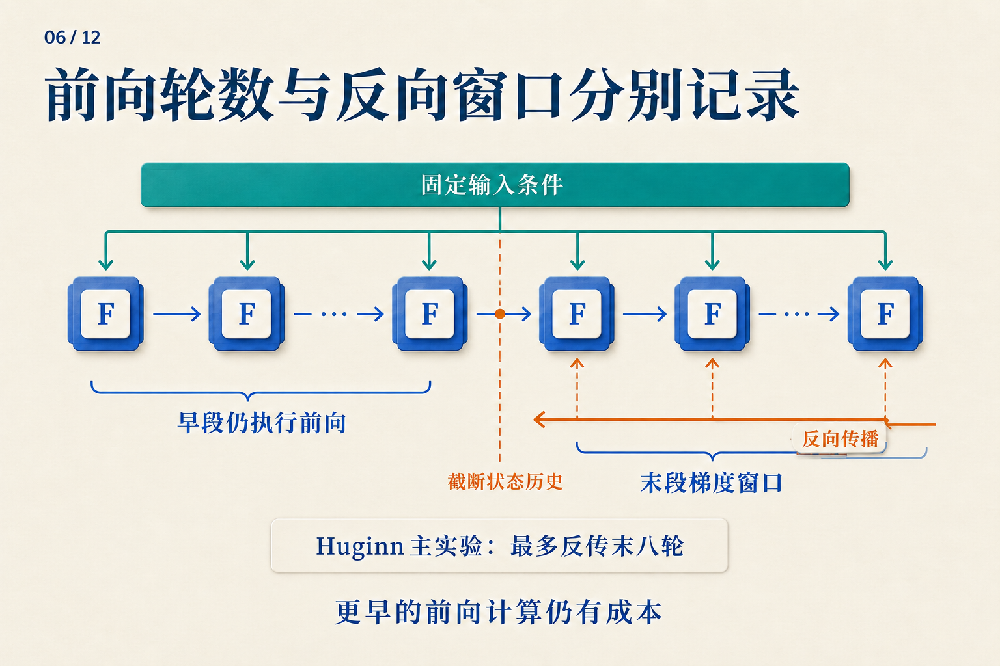
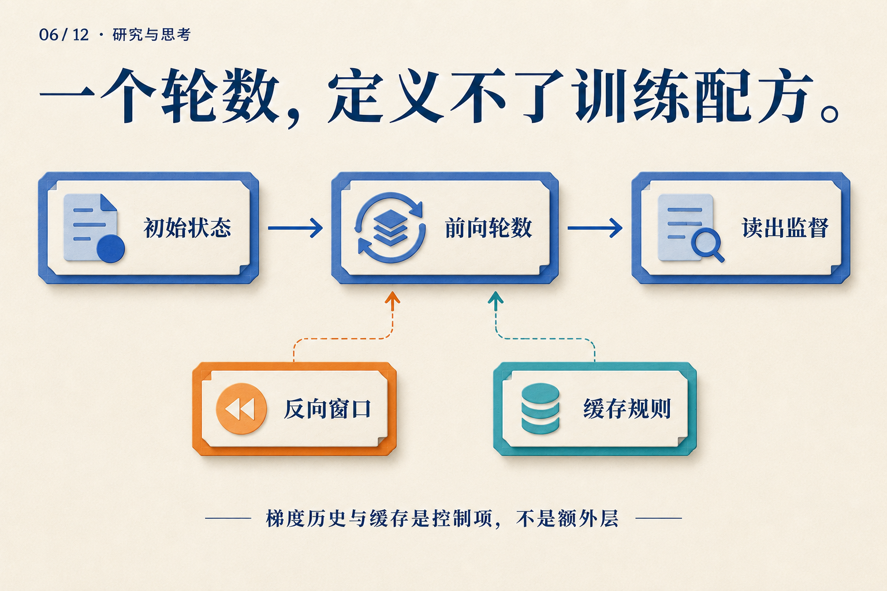

# 跑了四轮，为什么梯度只穿过两轮？

训练循环模型时，“运行四轮”还没有说明损失怎样训练这四轮。我们先用一个能手算的小循环，把前向计算和反向传播分开看，再把它接到语言模型上。

**下面是教学用的标量模型，不是 Huginn 或 Ouro 的实测状态。** 固定输入 `e = 1`，初态 `s[0] = 0`，每轮使用同一个参数 `w = 0.5`：

` s[r] = w × s[r−1] + e `

这里的 `e` 每轮都重新加入。状态在变，参数与输入不变。

## 先把四轮真的算完

| 轮次 | 本轮计算 | 得到的状态 |
|---|---|---:|
| 1 | `0.5 × 0 + 1` | 1 |
| 2 | `0.5 × 1 + 1` | 1.5 |
| 3 | `0.5 × 1.5 + 1` | 1.75 |
| 4 | `0.5 × 1.75 + 1` | 1.875 |

假设目标是 2，只在第四轮计算平方损失：`L = (s[4] − 2)² / 2 = 0.0078125`。

前三轮没有各自的损失，却参与了第四轮状态的形成。若完整反向传播，训练会沿着整条依赖链，计算每次使用 `w` 对最终误差的贡献，再把这些贡献加到**同一个参数**上。

现在做一个改变：第二轮结束后，保留数值 1.5，但不再追溯它怎样产生。自动微分里通常把这个操作叫 `detach`。

```text
s = 0
s = w * s + e       # round 1
s = w * s + e       # round 2
s = detach(s)       # keep 1.5; stop its gradient history
s = w * s + e       # round 3
s = w * s + e       # round 4
loss = (s - 2)**2 / 2
```

**前向结果一模一样，梯度却不同。** 完整链中，`s[4] = 1 + w + w² + w³`，所以在 `w = 0.5` 时，`dL/dw = −0.34375`。截断后，反向把第二轮的 1.5 视为常数，得到 `dL/dw = −0.3125`。

这个差别正是截断所放弃的信息。早两轮照常执行，最终答案也仍依赖它们；只是本次梯度不再穿过那些计算。由于 `w` 是共享的，后两轮算出的梯度仍会更新它，下次前向的早两轮也会用到更新后的 `w`。



*在手算例子中，把边界放在第二轮之后即可。图中的省略号表示一般展开，右下角“最多末八轮”对应 Huginn 主实验，不是本例的两轮。*

## 换成语言模型，什么变了？

把标量 `s` 换成状态矩阵，把 `w × s + e` 换成共享 Transformer 核心，终点接上读出头，就得到一个基本形式：

```text
e = prelude(tokens)
s = initial_state()
repeat K times:
    s = core(e, s)
logits = coda(s)
loss = next_token_loss(logits, target_tokens)
```

下一词标签能够监督整个循环，而不必为每一轮准备一段“正确想法”。损失位置决定哪些状态必须可读；反向窗口决定这次训练能追溯多长的形成过程。它们是两个旋钮。

例如，四轮都执行，可以只监督第四轮；也可以在第二、第四轮分别读出，并组合两个损失。前者允许第二轮暂时不好解码，后者要求它也对目标负责。**多算一个读出损失，不等于多执行一轮核心。**

Huginn 的具体选择是：前奏提供固定条件，随机初始化循环状态，拼接条件与状态后送入共享核心，最后由终曲读出。大型配置为两层前奏、四层核心、两层终曲；若核心运行 32 次，执行深度是 `2 + 4 × 32 + 2 = 132` 层。[Huginn v1，§3.1–3.2](https://arxiv.org/abs/2502.05171v1)

Huginn 用 log-normal Poisson 分布采样前向轮数，在选定终点做下一词预测；主实验最多反传末八轮。前奏仍能通过末段各轮的输入注入收到梯度。大型训练还在每个 microbatch 内跨 worker 同步采样深度。[Huginn v1，§3.3、§4.1](https://arxiv.org/abs/2502.05171v1)

现在，“最多末八轮”就不再像一句抽象的工程说明：它与手算例子中保留早段数值、截断早段历史是同一类选择。

## 终点怎么选，也会改变学到的更新

如果每次只在第四轮监督，网络可以依赖这个固定终点。若训练有时在第二轮、有时在第六轮结束，共享核心与读出头就会接触不同成熟程度的状态。

不过，训练平均四轮不意味着第六轮从未见过。判断测试深度是否超出训练覆盖，需要实际采样记录，而不仅是一行平均值。反向窗口也应单独记录：前向曾跑到那里，不表示梯度曾穿过那么长的链。

另一种办法是同一次前向在多个深度计算损失。Ouro 使用重复的共享层栈，并按学习到的退出分布加权各轮语言模型损失，再加入鼓励分布保持熵的正则项。[Ouro v1，§3.1–3.3](https://arxiv.org/abs/2510.25741v1)

可以用一个自造的两深度例子理解“加权损失”：若两个损失为 0.8、0.3，权重为 0.25、0.75，则任务损失部分为 `0.25 × 0.8 + 0.75 × 0.3 = 0.425`。这是把两个评价结果加权；它没有先把两个隐藏状态平均。ACT 的状态和输出加权混合是另一种计算，不能只因为都有权重就混为一谈。[ACT v6，§2](https://arxiv.org/abs/1603.08983v6)

## 某个 token 提前退出，剩下的还读得到它吗？

前面的伪代码假设所有位置走相同轮数。若位置 A 只跑一轮、位置 B 要跑三轮，B 在第三轮想读取 A，就会遇到一个具体问题：A 没有第三轮的键和值。

Mixture-of-Recursions 把 token 路由与缓存访问一起设计。其按轮缓存只保存进入该轮的 token，注意力也局限于这些条目；另一种共享方式让后续轮次读取第一轮缓存。[Mixture-of-Recursions v3，§2.2.2](https://arxiv.org/abs/2507.10524v3)

这不是训练完成后随意替换的存储细节。两种规则改变 B 实际能读取的内容，也就改变了任务损失所训练的函数。



*从左到右追踪状态怎样得到预测；再看下面两个控制项怎样约束训练历史与可读信息。*

回到四轮标量循环：我们没有改前向结果，只改梯度历史，就已经得到了不同的参数更新。到了语言模型，还要加上终点采样、监督位置与缓存约定。真正可复现的“运行四轮”，应当让别人能重建这些决定，而不只是重建一个 `for` 循环。
