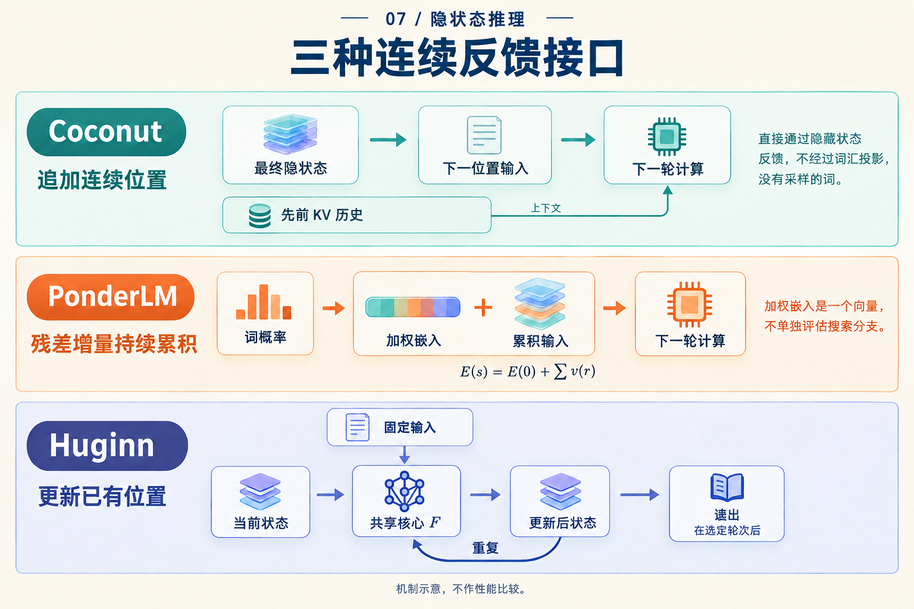

# 下一个向量，到底写到哪里？

两个模型都把向量送回计算，看起来都有一个环。但现在让它们各多算两步：一个会多出两个序列位置，另一个仍然只有原来的位置，只是每个位置的状态更新了两遍。

这项差别会影响模型能够再次读取什么。理解隐藏计算，可以先做一件很具体的事：**给每个向量标一个地址，再追踪下一步写入哪里。**

## 同样说“两步”，地址表却不同

下面只为说明地址，假设开始时有三个已处理的前缀位置。这个三位置例子是教学抽象，不对应一条真实题目的分词；Coconut 起点已包含开始连续阶段所需的边界，结束边界不计入下面两步。

Coconut 每增加一个连续步骤，就追加一个位置。Huginn 增加内部轮次时，更新的仍是原来的一组位置。把它们展开：

| 时刻 | Coconut 的序列地址 | Huginn 的状态快照 |
|---|---|---|
| 起点 | `1, 2, 3` | `s[1,0], s[2,0], s[3,0]` |
| 再计算一步 | `1, 2, 3, 4` | `s[1,1], s[2,1], s[3,1]` |
| 再计算两步 | `1, 2, 3, 4, 5` | `s[1,2], s[2,2], s[3,2]` |

*Huginn 的记号为 `s[位置,轮次]`。这里对照的是地址与更新方式，不是相同任务、相同 FLOPs 的性能实验。*

在左列，位置 4 已经变成可以再次访问的历史。在右列，`s[1,1]` 和 `s[1,2]` 是**同一序列位置**在不同深度的状态。第 2 轮不是把第 1 轮整套状态追加成新的序列地址。

*上排看右端新增的地址，下排看跨轮次仍相互对应的位置。图中方块数量没有表达内存容量。*

## 再读一个旧结果，意味着什么？

设想我们要处理几条存在依赖的事实。追加位置可以让较早计算留下不同的历史地址；以后的位置通过注意力读取这些地址的键和值。Coconut 的直接反馈只是提供新位置输入，已有 KV 历史仍然参与下一次计算。[Coconut v2，§3](https://arxiv.org/abs/2412.06769v2)

因此，“只传一个向量”没有说完它的记忆。当前向量与可读历史共同决定下一步。反过来，地址 4 的存在，也没有告诉我们它是否恰好保存了某个完整事实。

Huginn 的共享核心反复修改状态矩阵，同时接收固定前奏条件；在整段输入的 prefill 中，矩阵覆盖原来的序列位置。[Huginn v1，§3.1](https://arxiv.org/abs/2502.05171v1) 若一个量还要在后续轮次使用，更新过程需要在仍可访问的状态或缓存中保留所需信息。

不要把右列读成“所有旧信息都会消失”。实际系统可以保留不同层、不同深度的缓存，训练也可能保存反向传播需要的激活。表格只说它没有因为再跑一轮，就自动增加一个可注意的潜在序列位置。增量生成时，也不必每轮重算整个前缀。

这里出现了两种独立的问题：**有多少个序列地址，以及每个地址经历多少次变换。** 它们都可能有用，但不能直接用方块数量比较容量。状态宽度、缓存规则与可访问范围也必须相同或明确列出。

## 有一种反馈，还要先经过词表

地址之外，还需要问传回来的向量怎样构造。Coconut 直接用末层隐状态；PonderLM 则先得到词概率，用这些概率加权词嵌入，再把所得增量加入已有输入。[PonderLM v3，§2、式3–7](https://arxiv.org/abs/2505.20674v3)

用一个**自造的二维、双词词表**算一次。两个词嵌入分别是 `A = (1,0)`、`B = (0,1)`，当前输入是 `E[0] = (2,2)`。假设第一轮概率为 `(0.75,0.25)`，第二轮为 `(0.20,0.80)`：

| 更新 | 加权嵌入增量 | 累积后的输入 |
|---|---|---|
| 第一次 | `0.75A + 0.25B = (0.75,0.25)` | `E[1] = (2.75,2.25)` |
| 第二次 | `0.20A + 0.80B = (0.20,0.80)` | `E[2] = (2.95,3.05)` |

这些概率是为教学指定的，没有运行模型。它们让一个实现区别清楚可见：第二轮是在 `E[1]` 上继续加，因此第一轮的增量还在。若写成 `E[0] + 第二次增量`，就会得到 `(2.20,2.80)`，已经换成另一条更新规则。

每个增量是词嵌入的加权平均；在这个例子中，它位于连接 A、B 的线段上。但是累积输入不需要留在这条线段上。这也是为什么“概率混合向量”与“整个运行状态”不能混用。论文实现使用 top-100 候选近似，完整词表公式与实际候选选择应分别说明。[PonderLM v3，§2、脚注1](https://arxiv.org/abs/2505.20674v3)

## 现在再看三个箭头

*顺着每一行问两个问题：新向量来自哪里，下一次计算把它用在哪里？中排加号表示增量持续累积，不表示多条离散搜索分支各自运行。*

可以把刚才走过的接口压缩成三行，留作读论文时的核对表：

| 接口 | 下一步接收什么 | 主要改变的坐标 |
|---|---|---|
| Coconut | 上一位置末层隐状态，作为新位置输入 | 序列位置 |
| Huginn | 固定条件与更新中的状态 | 内部轮次 |
| PonderLM | 加上词概率加权嵌入后的累积输入 | 同一生成步骤内的前向次数 |

这张表不替各个架构规定统一的缓存，也不表示一“步”成本相等。它的用途是让一句模糊的“继续潜在计算”变成能画出执行顺序的说明。

两条坐标原则上也能组合：追加 `J` 个潜在位置，每个位置再运行 `K` 轮核心。但这要定义新的训练与缓存规则，并做预算匹配的实验，才能判断是否值得。单从两个箭头可以连接，还得不到收益结论。

下次看到“模型在向量空间里多想一步”，先在纸上写下 `位置4` 或 `位置3的第2轮`。确定了地址，再问输入从哪里来、历史还能读到什么，那个环才有了具体的计算含义。
