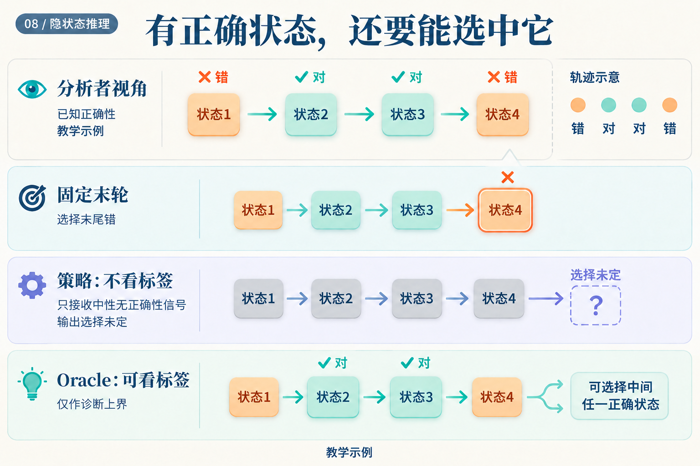

# 模型上一轮答对了，为什么还要继续？

假设同一个问题在连续四轮的读出结果是：**错、对、对、错**。这是人为构造的教学轨迹。最终读出会失败；知道标签的人却能指出，第二轮已经有正确答案了。

问题在于，部署系统并不知道这些“对”和“错”。它必须只凭当前可见信号，决定现在交卷，还是再算一轮。

*正确性标签来自分析者视角，不是给停机策略的输入。这张图没有记录任何真实模型输出。*

## 把“现在停”与“在这一轮退出”分开

设模型每轮输出一个条件停止概率 `a[r]`，意思是：**已经运行到第 r 轮的情况下，现在停止的概率。** 假设四轮的值为 `0.2、0.5、0.75、1`。这些数字同样是教学设定；最后设为 1，让剩余概率全部在第四轮退出。

第二轮的 0.5 并不代表一半请求在第二轮退出。第一轮已经停了 20%，只有剩下的 80% 能来到第二轮。因此，第二轮真正分到的退出质量为 `0.8 × 0.5 = 0.4`。

依次计算：

| 轮次 | 到达本轮的概率 | 条件停止概率 | 本轮退出质量 | 累计退出质量 |
|---|---:|---:|---:|---:|
| 1 | 1 | 0.2 | 0.2 | 0.2 |
| 2 | 0.8 | 0.5 | 0.4 | 0.6 |
| 3 | 0.4 | 0.75 | 0.3 | 0.9 |
| 4 | 0.1 | 1 | 0.1 | 1 |

第三轮的 0.3，就是前两轮都没停的 `0.8 × 0.5`，再乘本轮停止的 0.75。一般写成：

`q[r] = a[r] × ∏(1 − a[j])，其中 j < r`

现在得到的 `q = (0.2, 0.4, 0.3, 0.1)` 才是各轮的退出分布。Ouro 用这类条件概率构造累计分布，再以阈值确定退出深度。[Ouro v1，§3.2、算法1](https://arxiv.org/abs/2510.25741v1)

## 同一分布，可以有不同的交卷规则

若规则是“累计质量达到 0.8 就退出”，前两轮累计只有 0.6，第三轮达到 0.9，于是选择第三轮。阈值改为 0.95，就会走到第四轮。在我们的教学轨迹里，后一种更长的计算反而选中了错误结果。

还有另一种规则：真正按 `q` 随机抽取退出轮次。它在这个例子中的期望轮数为：

`1 × 0.2 + 2 × 0.4 + 3 × 0.3 + 4 × 0.1 = 2.3`

正确的第二、三轮合计概率为 `0.4 + 0.3 = 0.7`。这里的 70% 是对这条自造轨迹进行随机选择的计算结果，不是基准准确率。阈值 0.8 的规则则确定地运行三轮，不能拿 2.3 作为它的成本。

ACT 又是另一种用法。若把同样的前三个数 `0.2、0.5、0.75` 当作 ACT 停机值，按原文实验设置取阈值 `1 − ε = 0.99`（`ε = 0.01`），前两轮累计为 0.7，第三轮累计为 1.45，首次越过阈值；最后用剩余量 0.3 取代第三个权重。状态混合变成 `0.2s[1] + 0.5s[2] + 0.3s[3]`，而不是随机选择其中一个状态。它还加入计算成本惩罚。[ACT v6，§2–2.1](https://arxiv.org/abs/1603.08983v6)

因此，看见一组“停机概率”以后，还要读清它怎样参与计算：用于采样、用于累计阈值，还是用于状态混合。有限预算下也要规定尾部质量和强制停止规则；本例通过 `a[4] = 1` 明确处理了尾部。

## 真实模型会不会越算越差？

Ouro v1 表10报告，1.4B 基础模型的 MMLU 五样本平均成绩从四轮的 **67.45** 降到八轮的 **64.49**。这支持该设置下追加轮数未必改善准确率。表5又列出了前期八轮训练，与§5.3的“最大训练四轮”表述不一致，因此这里不把八轮描述为训练中从未出现的深度。[Ouro v1，表5、表10、§5.3](https://arxiv.org/abs/2510.25741v1)

但一张按深度汇总的成绩表，仍不足以告诉部署系统该在每道题的哪一轮停下。我们需要分别评估两件事：轨迹里有没有好答案，选择器能不能找到它。

## 有答案可选，与能选中答案

先固定一套产生完整轨迹的计算和缓存规则。一个知道正确标签的 oracle 可以检查预算内每轮，只要其中有正确答案，就把这道题计为成功。真实策略只能使用不含标签的信号，选择其中一轮。

*Oracle 的箭头使用了真实策略没有的信息。上界只针对同一条可选轨迹；不能拿另一种缓存或生成规则产生的轨迹冒充共同上界。*

在开头的例子里，oracle 成功，固定末轮失败。若轨迹是“错、错、错、错”，再聪明的选择器也找不到正确状态。

随机停止研究在 Unique Set 上对比了 oracle 与实际停机策略的差距，并指出差距小也可能只是模型稳定地答错。因而必须同时看策略准确率与差距。[Stochastic Stopping v1，附录C.3](https://arxiv.org/abs/2606.29983v1)

这个诊断也会改变下一步工作。如果轨迹经常含有正确答案，才值得重点改进选择；若很少出现正确答案，就应先改训练或更新机制。End-to-end Algorithm Synthesis 的一种训练思路是从随机到达的中间状态重新开始，截断早段梯度，再监督后续进展，并结合完整展开损失。它在所研究的算法任务中检验了这类改动。[论文 v3，§3.1–3.3](https://arxiv.org/abs/2202.05826v3)

## 最后，要在不知道标签时作出选择

低熵、答案不再变化、相邻状态距离变小，都可以是停机信号。但“很确定”与“继续算没有收益”是不同目标。Ouro 的专门门控阶段利用相邻深度损失改善提供监督：训练时可用标签，推理时依靠门控预测。[Ouro v1，§3.4](https://arxiv.org/abs/2510.25741v1)

一个可执行的部署比较，可以先固定同一个 checkpoint，在验证集上选择固定深度与停机阈值，随后冻结这些选择，在测试集比较：

| 比较对象 | 需要回答的问题 |
|---|---|
| 固定深度 | 不使用额外选择器，能达到什么质量与延迟？ |
| 实际停机策略 | 在不知道测试标签时，省下的计算是否值得准确率变化？ |
| 同轨迹 oracle | 有多少正确答案已经出现，却被实际规则错过？ |

如果实现按 token 分配深度，提前退出还会改变后续位置的缓存访问；Mixture-of-Recursions 因而联合设计路由与缓存。[Mixture-of-Recursions v3，§2.2](https://arxiv.org/abs/2507.10524v3) 实测延迟需要包含这些执行细节，不能只用平均轮数替代。

开头那条“错、对、对、错”的轨迹没有唯一的部署答案，因为我们故意没有给出可用的识别信号。它清楚地划开了目标：先让模型产生值得选的状态，再训练一条不看标签的规则，把合适的状态及时交出去。
