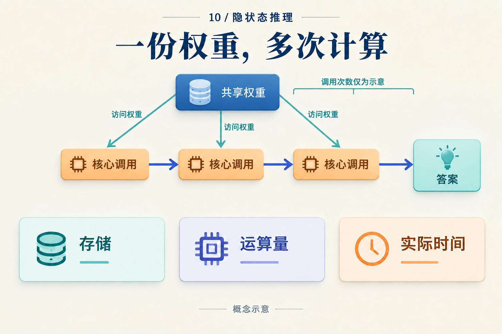
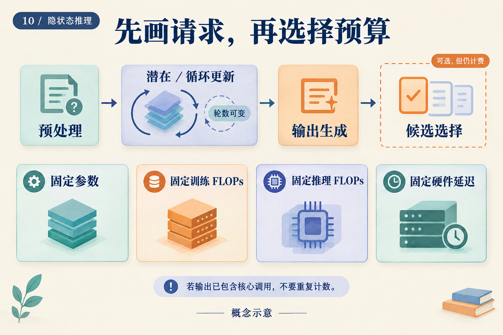

# 少写八个词元，到底省了多少计算？

两个系统回答同一道题。甲先写八个推理词元，再写两个答案词元；乙在内部做四步连续计算，最后只写两个答案词元。屏幕上，乙短了很多。计算账单也一样吗？

先做一笔**完全假想的教学账单**。下列工作量都是人为指定值，不来自某个模型的实测或 FLOPs 分析。单位记作 U：它表示同一种归一化运算量，不能换算成毫秒。我们假设每次调用的成本已包含该步需要的注意力、缓存读取与读出；为便于算术，同类调用在这段短请求里成本恒定。

## 从调用次数算起

两者预处理都花 12 U。甲的每个生成步骤花 2 U；乙的连续步骤花 3 U，答案步骤花 2 U。它们都只产生一个候选，不用额外选择器。

| 账项 | 甲：文字链 | 乙：连续链 |
|---|---:|---:|
| 预处理 | 12 | 12 |
| 中间计算 | 8 × 2 = 16 | 4 × 3 = 12 |
| 答案生成 | 2 × 2 = 4 | 2 × 2 = 4 |
| 合计 | 32 U | 28 U |

乙少了八个可见词元，但这笔账里只少了 `32 − 28 = 4 U`，即甲总量的 12.5%。它用四次较贵的内部调用，替换了八次较便宜的文字调用。答案长度不是这张表的计量单位。

现在只改一个假设：乙还要调用一个花 6 U 的验证器。总量变成 34 U，超过甲的 32 U。或者乙的连续调用单价从 3 U 变为 4 U，它即使不用验证器，也会达到 32 U。几次简单加法就说明了为什么应先还原执行路径，再比较生成长度。

这个例子还没有给甲乙分配准确率。因此，它只能演示怎样核算，不能推荐哪个系统。真正的比较至少要把答对多少题放到账单旁边。

*图中的三个调用只是结构示意，并非上表甲或乙的调用次数。权重可以存一份，使用它的每次运算仍须计入。*

## 把这张小表换成真实模型的账

在实际系统里，单步成本会随上下文长度、缓存策略、精度与路由变化。一个可用的记账抽象是：

`请求工作量 = 预处理 + 中间更新之和 + 答案生成之和 + 候选选择`

如果需要符号，可以写成：

`F = Fpre + Σⱼ rⱼ Fcore(nⱼ) + Σᵢ Fout(nᵢ) + Fselect`

第 j 个中间位置执行 `rⱼ` 次核心，当时可访问的上下文长度是 `nⱼ`。输出项逐步累计答案生成。这个式子只是把调用分组，不是某篇论文的精确 FLOPs 公式。若一次输出调用已经包含循环核心，就只在一个账项里计入；视觉编码、检索和裁判也应进入实际执行的账项。

CODI 的学生逐步产生连续状态后再输出答案，教师任务和激活对齐参与训练。TRM 则复用小网络更新潜在状态和答案表示。两者都需要沿各自的计算图数调用，不能仅从输出长度或参数量推出开销。[CODI v3，§3](https://arxiv.org/abs/2502.21074v3)；[TRM v1，图3](https://arxiv.org/abs/2510.04871v1)

缓存尤其容易漏算。保留旧 key/value 可以避免重算历史，却需要存储和读取；不同深度的表示也不一定能共用同一份缓存。Log-ICoT 还有一个直观例子：其理论推理保留被置零的 CoT 位置。没有生成那些中间词元，不代表相应位置不参与计算。[Log-ICoT v1，§3.1 Evaluation](https://arxiv.org/abs/2605.28600v1)

## 工作量更少，为什么还要测时间？

回到 32 U 与 28 U。只有假设两种执行使用相同的有效运算速率、没有其他开销，才能按这个比例估计时间。真实硬件上，串行依赖、小算子的启动、内存带宽和批处理都可能改变速率。

如果乙把四步连成一条依赖链，下一步必须等上一步完成；甲的另一个策略可能同时生成多个独立候选。两者的总工作量和完成时间可以朝不同方向变化。省下的运算是否转化成用户更早收到答案，要在目标硬件上测。

测量边界也要一致：从请求进入到首个答案词元，和到完整答案返回，是两段不同时间。固定精度与批量，分别报告预热后的请求延迟、尾部延迟和吞吐；冷启动另报。GPU 计时须处理异步执行，否则主机“提交完工作”可能被误记为“设备做完工作”。

*上半部帮助补齐账项；下半部提醒我们选择比较问题。四个预算条件通常无法同时配平。*

固定参数量适合问存储规模的价值；固定训练 FLOPs 适合问同样投入能训练出什么；固定推理 FLOPs 比较一次请求如何使用计算；固定硬件延迟则把实现效率也纳入答案。报告时选定主约束，并公开其他差异。

## 训练账单会不会改变选择？

假设乙比甲额外花了 4,000 U 的训练工作，此后每次请求恰好省 4 U。这仍是同一教学账单中的人为设定。处理 N 次请求后，额外训练恰好被抵消的条件是：

`4,000 = N × (32 − 28)`

所以 `N = 1,000`。少于一千次，乙尚未抵消额外训练；多于一千次，才开始节省这种工作量。如果加入刚才的 6 U 验证器，乙的单请求成本更高，就没有这个正的盈亏平衡点。这里也没算货币价格：训练与服务硬件的单位成本可能不同。

真实训练的前向、反向和重复监督都要入账。TRM 的图3区分无梯度递归与带梯度递归；前者仍执行前向。HRM 的梯度近似与深监督同样影响训练路径。[TRM v1，图3、§4.1](https://arxiv.org/abs/2510.04871v1)；[HRM v3，梯度近似与深监督](https://arxiv.org/abs/2506.21734v3)

若方法共享同一个基础 checkpoint，可以另报增量训练成本；若起点不同，已知的训练历史和未知项都应写明。教师轨迹生成一次后缓存，与每批在线生成，也会得到不同账单。

最后给同一批保留测试题同时保存答案与成本：所有题都进入分母，解析失败和超时也留下记录；阈值与 checkpoint 在验证集选定。按同一个 checkpoint 扫预算，回答的是它能否利用更多计算；每档预算重新训练，回答的是另一件事。可复核的结论应当能从模型、数据、调用日志和计时边界重新算出来，就像开头那张小表一样。
