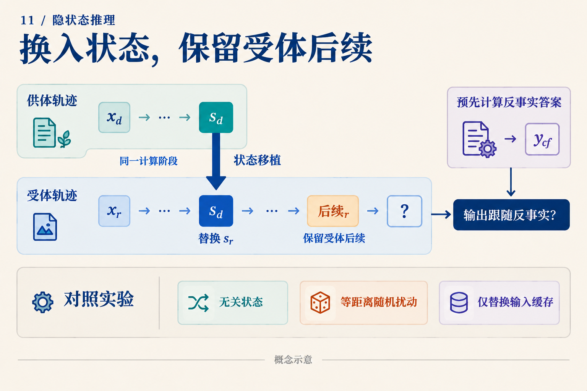

# 隐状态里读出了36，然后呢？

三箱零件，每箱十二个，坏了四个，还剩多少？手算是 `3 × 12 = 36`，再算 `36 − 4 = 32`。假设研究者从模型的某个隐状态中读出了36，又看到模型最后回答32。能否说模型先算乘法，再使用36做减法？

还差一个实验。下面用这道**人为构造的教学题**说明差在哪；我们没有运行模型，也没有声称某个向量实际编码了36。

## 读出器答对，可能是谁算对了？

研究者可以训练一个小网络，把隐状态 h 映射成中间答案。这个网络叫探针。写成 `q(h) ≈ 36`，意思是 q 能从 h 恢复36。

一种可能是 h 已经保存了乘法结果。另一种可能是 h 只保留“3”和“12”，探针自己完成乘法。还有一种可能是36确实存在，但主模型得到32时走了另一条计算路径。三种情况都允许探针答对。

*先沿上方路径看探针恢复了什么，再沿主路径问答案依赖什么。虚线是一种待排查的解释，不是所有模型都存在的已知旁路。*

因此，探针首先用于定位信息。应把探针训练数据与评价数据分开，在验证集选择容量，并加入“只看原输入”的同容量探针。如果后者也能得到36，就必须考虑探针本身的计算能力。Logit lens 借用词汇读出映射，注意力图展示路由权重；它们也各有可见范围，不能单凭一张热图决定信息的因果作用。

## 把“用了36”变成一个不同的预测

再准备一道题：五箱零件，每箱八个，坏了七个。它的中间值是40，答案是33。现在有两条自然运行可以作为候选：

| 运行 | 乘法结果 | 后续操作 | 原答案 |
|---|---:|---|---:|
| 受体 A | 36 | 减4 | 32 |
| 供体 B | 40 | 减7 | 33 |

设想在相同的候选计算阶段，把 B 的一处激活移入 A，保留 A 后续的“减4”。如果这个激活承载了可供后续使用的中间数，新的预测应该是：

`40 − 4 = 36`

36同时不同于 A 原答案32和 B 原答案33。这个设计很重要：若我们期待的结果恰好就是供体答案，就难以排除整份答案被复制过去。

这叫反事实续算：先用任务规则算出“换了中间值后应该得到什么”，再检查干预后的模型输出。预期的36来自手写算术，不是一个已观察到的模型结果。

*图把“移什么、留什么、期待什么”分开。s表示候选运行状态，并不预先保证它只编码一个标量。*

真正实施时，必须明确替换对象：哪一层、哪个位置、残差流还是特定分量；是否重新计算下游缓存。输入长度与位置编码也要匹配。不能把一条轨迹的全部缓存搬过去，又把结果解释成某一个向量的作用。

还要用多组前缀和多种后续操作重复这个检验。例如同样移入40，再分别要求减4、减6，预期答案就分别是36、34。如果同一候选状态能随受体后续改变结果，才更接近“可继续使用的中间量”这个解释。

## 哪些对照能排除更简单的解释？

先做不改变状态的自我替换。连它都破坏输出，通常应先检查实现。再找另一道中间值同为36、前缀却不同的题，替换到 A：按中间值假说仍应得到32。这检验的是表示兼容性，而不是单独证明因果使用。

然后比较三种真正改变运行的对照。第一种移入同阶段但与目标中间量无关的状态；第二种加入与替换差向量 `h_B − h_A` 的范数相同的随机扰动；第三种只更换输入缓存、不动候选激活。如果只有语义匹配的替换稳定产生反事实答案，解释就比“受到了任意扰动”更有针对性。若缓存替换也能产生同样效果，输入旁路值得进一步定位。

这些对照也不能让一次失败变得容易解释。混合供体激活和受体缓存可能制造训练中未出现的状态。所有替换都失败，只说明这次干预没有得到预期续算；还可能是替换位置不对、信息分散在多个位置，或者干预组合不兼容。不能直接宣布模型没有中间计算。

## 已有机制研究实际发现了什么？

《Do Latent-CoT Models Think Step-by-Step?》研究的是模数上的多项式迭代，而非上面的零件题。它用小型 GPT-2 风格的 CODI 模型，把探针、logit lens、注意力分析和激活替换结合起来。少跳任务中，中间“桥接状态”和最后输入的近直接路径共同参与答案形成；更多跳数时，分析看到的潜在轨迹更偏向较晚的中间量。[原论文 v1，§3–4、附录C–D](https://arxiv.org/abs/2602.00449v1)

这说明“有中间信息”和“有完整逐步轨迹”之间可以存在很多结构。结论绑定该模型、任务、训练协议和诊断工具。没有读出某一步，也可能是所用读出器没有捕获其编码；论文中的模数结构更不能直接推广为所有自然语言任务的规律。上面的反事实数值例子与对照是本文教学设计，不是该论文报告的实验结果。

同样的问题可以迁移到视觉输入。MCOUT-Base 反馈末端隐状态；MCOUT-Multi 将它与多模态嵌入结合，产生追加到序列中的思维嵌入。[MCOUT v2，§3.1–3.2](https://arxiv.org/abs/2508.12587v2) 若想知道后期步骤是否还读取图像证据，可以保持问题文字不变，替换决定答案的视觉关系，再比较早期与后期的干预。重复读既有嵌入和重新运行视觉编码器是两种不同操作。

模型命名也需要接受这种检验。HRM 的高低层模块是不同更新频率的 Transformer 模块；名称并不自动给出“规划/执行”的语义分工。[HRM v3，架构细节](https://arxiv.org/abs/2506.21734v3) TRM 复用一个小网络更新潜在状态 z 和答案表示 y；这些结构给出了干预位置，实际功能仍需追踪。[TRM v1，图3、§4.1](https://arxiv.org/abs/2510.04871v1)

下一次从隐状态读出36，可以把它看作一个值得追查的线索。更有说服力的下一步，是换掉相关信息后，模型按预先指定的方式继续计算，并且在匹配对照中表现出选择性。我们要解释的是这条作用路径，而不只是给向量贴上一个好懂的标签。
